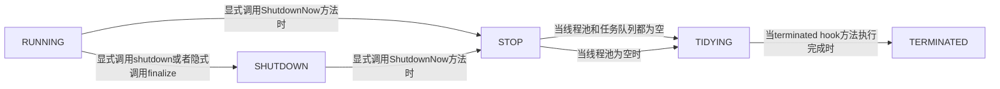

# java异步编程实战

## 第二章


```java
public class ThreadPoolExecutor extends AbstractExecutorService {
 	 	//高3位用来标记线程池状态，低29位用来标志线程个数
  	private final AtomicInteger ctl = new AtomicInteger(ctlOf(RUNNING, 0));
  	//线程个数掩码位数
    private static final int COUNT_BITS = Integer.SIZE - 3;
  	//线程最大个数，00011111111111111111111111111111
    private static final int COUNT_MASK = (1 << COUNT_BITS) - 1;
  
  	//接收新任务并且处理阻塞队列里的任务,11100000000000000000000000000000
  	private static final int RUNNING    = -1 << COUNT_BITS;
  	//拒绝新任务但是处理阻塞队列里的任务，00000000000000000000000000000000
    private static final int SHUTDOWN   =  0 << COUNT_BITS;
  	//拒绝新任务，抛弃阻塞队列里的任务，同时中断正在处理的任务，00100000000000000000000000000000
    private static final int STOP       =  1 << COUNT_BITS;
  	//所有任务都执行完（包含阻塞队列里面任务），当前线程池活动线程为0，将要调用terminated方法，01000000000000000000000000000000
    private static final int TIDYING    =  2 << COUNT_BITS;
  	//终止状态。terminated方法调用完成以后的状态，01100000000000000000000000000000
    private static final int TERMINATED =  3 << COUNT_BITS;
		
  	//获取高3位运行状态
    private static int runStateOf(int c)     { return c & ~COUNT_MASK; }
  	//获取低29位线程个数
    private static int workerCountOf(int c)  { return c & COUNT_MASK; }
  	//计算ctl新值，线程状态 与 线程个数
    private static int ctlOf(int rs, int wc) { return rs | wc; }

}
```

线程池状态转换路径



线程池是可配置的，使用者可以使用如下配置参数


```java
corePoolSize//线程池核心线程个数
workQueue//用于保存等待执行的任务的阻塞队列，比如基于数组的有界Array-BlockingQueue、基于链表的无界LinkedBlockingQueue、最多只有一个元素的同步队列SynchronousQueue、优先级队列PriorityBlockingQueue等。
maximunPoolSize//线程池最大线程数量
threadFactory//创建线程的工厂类
defaultHandler//饱和策略，当队列满了并且线程个数达到maximunPoolSize后采取的策略，比如AbortPolicy（抛出异常）、CallerRunsPolicy（使用调用者所在线程来运行任务）、DiscardOldestPolicy（调用poll丢弃一个任务，执行当前任务）、DiscardPolicy（默默丢弃，不抛出异常）
keeyAliveTime//存活时间。如果当前线程池中的线程数量比核心线程数量要多，并且是闲置状态的话，这些闲置的线程能存活的最大时间
```

- mainLock是独占锁，用来控制新增Worker线程时的原子性，termination是该锁对应的条件队列，在线程调用awaitTermination时用来存放阻塞的线程。

- Worker继承AQS和Runnable接口，是具体承载任务的对象。Worker继承了AQS，实现了简单不可重入独占锁，其中state=0标示锁未被获取的状态，state=1标示锁已经被获取的状态，state=–1是创建Worker时默认的状态。创建时状态设置为–1是为了避免该线程在运行runWorker()方法前被中断，下面会具体讲解到。其中变量firstTask记录该工作线程执行的第一个任务，Thread是具体执行任务的线程。

- DefaultThreadFactory是线程工厂，newThread方法是对线程的一个修饰。其中，poolNumber是个静态的原子变量，用来统计线程工厂的个数，threadNumber用来记录每个线程工厂创建了多少线程，这两个值也作为线程池和线程的名称的一部分。

### 提交任务到线程池


```java
public void execute(Runnable command) {
        if (command == null)
            throw new NullPointerException();
  			//获取线程池状态与线程个数
        int c = ctl.get();
  			//如果当前线程池线程数小于核心线程数，新加一个核心线程并且刷新状态
        if (workerCountOf(c) < corePoolSize) {
            if (addWorker(command, true))
                return;
            c = ctl.get();
        }
  			//如果线程池处于Running状态，添加任务到阻塞队列
        if (isRunning(c) && workQueue.offer(command)) {
          	//二次检查
            int recheck = ctl.get();
            //如果不是Running状态，从任务队列移除任务，并执行拒绝策略
            if (! isRunning(recheck) && remove(command))
                reject(command);
            //如果当前线程池为空，则添加一个线程
            else if (workerCountOf(recheck) == 0)
                addWorker(null, false);
        }
  			//如果队列满了，新增线程，新增失败则执行拒绝策略
        else if (!addWorker(command, false))
            reject(command);
    }
```

```java
public Future<?> submit(Runnable task) {
        if (task == null) throw new NullPointerException();
        RunnableFuture<Void> ftask = newTaskFor(task, null);
        execute(ftask);
        return ftask;
    }

    /**
     * @throws RejectedExecutionException {@inheritDoc}
     * @throws NullPointerException       {@inheritDoc}
     */
    public <T> Future<T> submit(Runnable task, T result) {
        if (task == null) throw new NullPointerException();
        RunnableFuture<T> ftask = newTaskFor(task, result);
        execute(ftask);
        return ftask;
    }

    /**
     * @throws RejectedExecutionException {@inheritDoc}
     * @throws NullPointerException       {@inheritDoc}
     */
    public <T> Future<T> submit(Callable<T> task) {
        if (task == null) throw new NullPointerException();
        RunnableFuture<T> ftask = newTaskFor(task);
        execute(ftask);
        return ftask;
    }
```

### 执行任务

当用户线程提交任务到线程池后，在线程池没有执行拒绝策略的情况下，用户线程会马上返回，而提交的任务要么直接切换到线程池中的Worker线程来执行，要么先放入线程池的阻塞队列里面，稍后再由Worker线程来执行。

```java
 Worker(Runnable firstTask) {
   //在运行runworker以前禁止中断，这个state是抽象队列同步器的状态，设为-1是为了避免当前Worker在调用runWorker方法前被中断（当其他线程调用了线程池的shutdownNow时，如果Worker状态≥0则会中断该线程）
            setState(-1); 
   //把传递的任务firstTask保存起来
            this.firstTask = firstTask;
   //使用线程池中指定的线程池工厂创建一个线程作为该Worker对象的执行线程
            this.thread = getThreadFactory().newThread(this);
        }
```

Worker实现了Runnable方法，所以实现了run方法，run方法中调用了runWorker方法

```java
final void runWorker(Worker w) {
        Thread wt = Thread.currentThread();
        Runnable task = w.firstTask;
        w.firstTask = null;
        w.unlock(); // 将status变为0，此时调用shutdownNow会中断Worker线程
        boolean completedAbruptly = true;
        try {
          /*如果当前task==null或者调用getTask从任务队列获取的任务返回null，则跳转到代码3执行清理工作，当前Worker也就退出执行了*/
            while (task != null || (task = getTask()) != null) {
                w.lock();//获取独占锁，执行具体任务期间加锁，是为了避免任务运行期间，其他线程调用了shutdown方法关闭线程池时中断正在执行任务的线程
                // If pool is stopping, ensure thread is interrupted;
                // if not, ensure thread is not interrupted.  This
                // requires a recheck in second case to deal with
                // shutdownNow race while clearing interrupt
                if ((runStateAtLeast(ctl.get(), STOP) ||
                     (Thread.interrupted() &&
                      runStateAtLeast(ctl.get(), STOP))) &&
                    !wt.isInterrupted())
                    wt.interrupt();
                try {
                  //执行扩展接口代码
                    beforeExecute(wt, task);
                    try {
                      //执行具体任务
                        task.run();
                      //任务完成后做一些事情
                        afterExecute(task, null);
                    } catch (Throwable ex) {
                        afterExecute(task, ex);
                        throw ex;
                    }
                } finally {
                    task = null;
                    w.completedTasks++;
                    w.unlock();
                }
            }
            completedAbruptly = false;
        } finally {
            processWorkerExit(w, completedAbruptly);
        }
    }
```

processWorkerExit方法

```java
    private void processWorkerExit(Worker w, boolean completedAbruptly) {
        if (completedAbruptly) // If abrupt, then workerCount wasn't adjusted
            decrementWorkerCount();
				//统计整个线程池完成的任务个数,并从工作集里面删除当前woker 
        final ReentrantLock mainLock = this.mainLock;
        mainLock.lock();
        try {
            completedTaskCount += w.completedTasks;
            workers.remove(w);
        } finally {
            mainLock.unlock();
        }
				//尝试设置线程池状态为TERMINATED，如果当前是shutdonw状态并且工作队列为空,或者当前是stop状态且当前线程池里面没有活动线程
        tryTerminate();

       //如果当前线程个数小于核心线程个数，则增加
        int c = ctl.get();
        if (runStateLessThan(c, STOP)) {
            if (!completedAbruptly) {
                int min = allowCoreThreadTimeOut ? 0 : corePoolSize;
                if (min == 0 && ! workQueue.isEmpty())
                    min = 1;
                if (workerCountOf(c) >= min)
                    return; // replacement not needed
            }
            addWorker(null, false);
        }
    }
```

### 关闭线程池


```java
public void shutdown() {
        final ReentrantLock mainLock = this.mainLock;
        mainLock.lock();
        try {
            checkShutdownAccess();
            advanceRunState(SHUTDOWN);
            interruptIdleWorkers();
            onShutdown(); // hook for ScheduledThreadPoolExecutor
        } finally {
            mainLock.unlock();
        }
        tryTerminate();
    }
```

### 拒绝策略


## 第三章

### Future

只是一个接口，提供了如下方法

```java
package java.util.concurrent;public interface Future<V> {    boolean cancel(boolean mayInterruptIfRunning);    boolean isCancelled();    boolean isDone();    V get() throws InterruptedException, ExecutionException;    V get(long timeout, TimeUnit unit)        throws InterruptedException, ExecutionException, TimeoutException;}
```

### FutureTask

FutureTask实现了Future接口，提供了启动和取消任务、查询任务是否完成、获取计算结果的接口。FutureTask任务的结果只有当任务完成后才能获取，并且只能通过get系列方法获取，当结果还没出来时，线程调用get系列方法会被阻塞。另外，一旦任务被执行完成，任务将不能重启，除非运行时使用了runAndReset方法。FutureTask中的任务可以是Callable类型，也可以是Runnable类型（因为FutureTask实现了Runnable接口），FutureTask类型的任务可以被提交到线程池执行。

```java
public class FutureTest {
    public static String doSomethingA() {
        try {
            Thread.sleep(2000);
        } catch (InterruptedException e) {
            e.printStackTrace();
        }
        System.out.println("--- doSomethingA---");
        return "TaskAResult";
    }

    public static String doSomethingB() {
        try {
            Thread.sleep(2000);
        } catch (InterruptedException e) {
            e.printStackTrace();
        }
        System.out.println("--- doSomethingB---");
        return "TaskBResult";
    }

    public static void main(String[] args) throws InterruptedException, ExecutionException {

        long start = System.currentTimeMillis();

        // 1.创建future任务
        FutureTask<String> futureTask = new FutureTask<>(() -> {
            String result = null;
            try {
                result = doSomethingA();
            } catch (Exception e) {
                e.printStackTrace();
            }
            return result;
        });

        // 2.开启异步单元执行任务A
        Thread thread = new Thread(futureTask, "threadA");
        thread.start();

        // 3.执行任务B
        String taskBResult = doSomethingB();

        // 4.同步等待线程A运行结束
        String taskAResult = futureTask.get();

        // 5.打印两个任务执行结果
        System.out.println(taskAResult + " " + taskBResult);
        System.out.println(System.currentTimeMillis() - start);

    }
}
```

也可以把任务投递到线程池执行

```java
private final static int AVALIABLE_PROCESSORS = Runtime.getRuntime().availableProcessors();    private final static ThreadPoolExecutor POOL_EXECUTOR = new ThreadPoolExecutor(            AVALIABLE_PROCESSORS,            AVALIABLE_PROCESSORS * 2,            1, TimeUnit.MINUTES,            new LinkedBlockingQueue<>(5),            new ThreadPoolExecutor.CallerRunsPolicy()    );// 2.开启异步单元执行任务A        POOL_EXECUTOR.execute(futureTask);//或者也可以替换1处的代码// 1.开启异步单元执行任务A        Future<String> futureTask = POOL_EXECUTOR.submit(() -> {            String result = null;            try {                result = doSomethingA();            } catch (Exception e) {                e.printStackTrace();            }            return result;        });
```

### CompletableFuture

- FutureTask虽然提供了用来检查任务是否执行完成、等待任务执行结果、获取任务执行结果的方法，但是这些特色并不足以让我们写出简洁的并发代码，比如它并不能清楚地表达多个FutureTask之间的关系。另外，为了从Future获取结果，我们必须调用get()方法，而该方法还是会在任务执行完毕前阻塞调用线程，这明显不是我们想要的。

  我们真正想要的是：

  - 可以将两个或者多个异步计算结合在一起变成一个，这包含两个或者多个异步计算是相互独立的情况，也包含第二个异步计算依赖第一个异步计算结果的情况。

  - 对反应式编程的支持，也就是当任务计算完成后能进行通知，并且可以以计算结果作为一个行为动作的参数进行下一步计算，而不是仅仅提供调用线程以阻塞的方式获取计算结果。

  - 可以通过编程的方式手动设置（代码的方式）Future的结果
  - 可以等多个Future对应的计算结果都出来后做一些事情。

  为了克服FutureTask的局限性，以及满足我们对异步编程的需要，JDK8中提供了CompletableFuture。

- CompletableFuture可以显式设置结果

  ```java
  public class TestCompletableFutureSet {
      // 0自定义线程池
      private final static int AVALIABLE_PROCESSORS = Runtime.getRuntime().availableProcessors();
      private final static ThreadPoolExecutor POOL_EXECUTOR = new ThreadPoolExecutor(AVALIABLE_PROCESSORS,
              AVALIABLE_PROCESSORS * 2, 1, TimeUnit.MINUTES, new LinkedBlockingQueue<>(5),
              new ThreadPoolExecutor.CallerRunsPolicy());
  
      public static void main(String[] args) throws InterruptedException, ExecutionException, TimeoutException, ExecutionException {
  
          // 1.创建一个CompletableFuture对象
          CompletableFuture<String> future = new CompletableFuture<String>();
  
          // 2.开启线程计算任务结果，并设置
          POOL_EXECUTOR.execute(() -> {
              // 2.1休眠3s，模拟任务计算
              try {
                  Thread.sleep(3000);
              } catch (InterruptedException e) {
                  e.printStackTrace();
              }
              // 2.2设置计算结果到future
              System.out.println("----" + Thread.currentThread().getName() + " set future result----");
              future.complete("hello,jiaduo");//FutureTask做不到
          });
  
          // 3.等待计算结果
          System.out.println("---main thread wait future result---");
          System.out.println(future.get());
          // System.out.println(future.get(1000,TimeUnit.MILLISECONDS));
          System.out.println("---main thread got future result---");
      }
  }
  ```

- 基于runAsync系列方法实现无返回值的异步计算

  ```java
   public static void main(String[] args) throws InterruptedException, ExecutionException {        CompletableFuture future = CompletableFuture.runAsync(() -> {            // 1.1.1休眠2s模拟任务计算            try {                Thread.sleep(2000);            } catch (InterruptedException e) {                e.printStackTrace();            }            System.out.println("over");        });        // 1.2 同步等待异步任务执行结束        System.out.println(future.get());    }
  ```

  需要注意的是，在默认情况下，runAsync(Runnable runnable)方法是使用整个JVM内唯一的ForkJoinPool.commonPool()线程池来执行异步任务的，使用runAsync(Runnable runnable，Executor executor)方法允许我们使用自己制定的线程池来执行异步任务。

  ```java
  public static void main(String[] args) throws InterruptedException, ExecutionException {
  
          CompletableFuture future = CompletableFuture.runAsync(() -> {
              // 1.1.1休眠2s模拟任务计算
              try {
                  Thread.sleep(2000);
              } catch (InterruptedException e) {
                  e.printStackTrace();
              }
              System.out.println("over");
          }, pool);
  
          // 1.2 同步等待异步任务执行结束
          System.out.println(future.get());
      }
  ```

- 基于supplyAsync系列方法实现有返回值的异步计算

  ```java
  public static void main(String[] args) throws InterruptedException, ExecutionException {
  
         // 2.1创建异步任务，并返回future
          CompletableFuture future = CompletableFuture.supplyAsync(() -> {
              // 2.1.1休眠2s模拟任务计算
              try {
                  Thread.sleep(2000);
              } catch (InterruptedException e) {
                  e.printStackTrace();
              }
              // 2.1.2 返回异步计算结果
              return "hello,jiaduo";
          });
  
          // 2.2 同步等待异步任务执行结束
          System.out.println(future.get());
      }
  ```

  同样允许自定义线程池

  ```java
  public static void main(String[] args) throws InterruptedException, ExecutionException {
  
         // 2.1创建异步任务，并返回future
          CompletableFuture future = CompletableFuture.supplyAsync(() -> {
              // 2.1.1休眠2s模拟任务计算
              try {
                  Thread.sleep(2000);
              } catch (InterruptedException e) {
                  e.printStackTrace();
              }
              // 2.1.2 返回异步计算结果
              return "hello,jiaduo";
          },pool);
  
          // 2.2 同步等待异步任务执行结束
          System.out.println(future.get());
      }
  ```

- 基于thenRun实现异步任务A，执行完毕后，激活异步任务B执行，需要注意的是，这种方式激活的异步任务B是拿不到任务A的执行结果的

  ```java
  public static void main(String[] args) throws InterruptedException, ExecutionException {        CompletableFuture<String> oneFuture = CompletableFuture.supplyAsync(() -> {            // 1.1休眠2s，模拟任务计算            try {                Thread.sleep(2000);            } catch (InterruptedException e) {                e.printStackTrace();            }            // 1.2返回计算结果            return "hello";        });        CompletableFuture twoFuture = oneFuture.thenRun(() -> {            // 2.1.1当oneFuture任务计算完成后做一件事情            try {                Thread.sleep(1000);            } catch (Exception e) {                e.printStackTrace();            }            System.out.println(Thread.currentThread().getName());            System.out.println("---after oneFuture over doSomething---");        });        // 3.同步等待twoFuture对应的任务完成，返回结果固定为null        System.out.println(twoFuture.get());    }
  ```

- 基于thenAccept实现异步任务A，执行完毕后，激活异步任务B执行，需要注意的是，这种方式激活的异步任务B是可以拿到任务A的执行结果的

  ```java
  public static void main(String[] args) throws InterruptedException, ExecutionException {        CompletableFuture<String> oneFuture = CompletableFuture.supplyAsync(() -> {            // 1.1休眠2s，模拟任务计算            try {                Thread.sleep(2000);            } catch (InterruptedException e) {                e.printStackTrace();            }            // 1.2返回计算结果            return "hello";        });        CompletableFuture twoFuture = oneFuture.thenAccept(t -> {            // 2.1.1对oneFuture返回的结果进行加工            try {                Thread.sleep(1000);            } catch (Exception e) {                e.printStackTrace();            }            System.out.println("---after oneFuture over doSomething---" + t);        });        System.out.println(twoFuture.get());    }
  ```

  在默认情况下，oneFuture对应的异步任务和在oneFuture上添加的回调事件都是使用ForkJoinPool.commonPool()中的同一个线程来执行的，大家可以使用thenAccept-Async(Consumer<?super T>action，Executor executor)来指定设置的回调事件使用自定义线程池线程来执行，也就是oneFuture对应的任务与在其上设置的回调执行将不会在同一个线程中执行。

- 基于thenApply实现异步任务A，执行完毕后，激活异步任务B执行。需要注意的是，这种方式激活的异步任务B是可以拿到任务A的执行结果的，并且可以获取到异步任务B的执行结果

  ```java
  public static void main(String[] args) throws InterruptedException, ExecutionException {
  
          CompletableFuture<String> oneFuture = CompletableFuture.supplyAsync(() -> {
              // 1.1休眠2s，模拟任务计算
              try {
                  Thread.sleep(2000);
              } catch (InterruptedException e) {
                  e.printStackTrace();
              }
              // 1.2返回计算结果
              return "hello";
          });
          // 2.1在步骤1计算结果基础上进行计算，这里t为步骤1返回的hello
          CompletableFuture<String> twoFuture = oneFuture.thenApply(t -> {
              // 2.1.1对oneFuture返回的结果进行加工
              try {
                  Thread.sleep(1000);
              } catch (Exception e) {
                  e.printStackTrace();
              }
              // 2.1.2返回加工后结果
              return t + " jiduo";
          });
  
          // 3.同步等待twoFuture对应的任务完成，并获取结果
          System.out.println(twoFuture.get());
      }
  ```

  默认情况下oneFuture对应的异步任务和在oneFuture上添加的回调事件都是使用ForkJoinPool.commonPool()中的同一个线程来执行的，大家可以使用thenApplyAsync(Function<?super T，?extends U>fn，Executor executor)来指定设置的回调事件使用自定义线程池线程来执行，也就是oneFuture对应的任务与在其上“设置的回调执行将不会在同一个线程中执行。

- 基于whenComplete设置回调函数，当异步任务执行完毕后进行回调，不会阻塞调用线程

  ```java
  public static void main(String[] args) throws InterruptedException {
           // 1.创建一个CompletableFuture对象
          CompletableFuture<String> future = CompletableFuture.supplyAsync(() -> {
              // 1.1模拟异步任务执行
              try {
                  Thread.sleep(1000);
              } catch (InterruptedException e) {
                  e.printStackTrace();
              }
              // 1.2返回计算结果
              return "hello,jiaduo";
          });
  
          // 2.添加回调函数
          future.whenComplete((t, u) -> {
              // 2.1如果没有异常，打印异步任务结果
              if (null == u) {
                  System.out.println(t);
              } else {
                  // 2.2打印异常信息
                  System.out.println(u.getLocalizedMessage());
  
              }
          });
  
          // 3.挂起当前线程，等待异步任务执行完毕
          Thread.currentThread().join();
      }
  ```

  在整个异步任务的执行过程中，main函数所在线程是不会被阻塞的，等异步任务执行完毕后会回调设置的回调函数，在回调函数内，代码2.1表示如果发现异步任务执行正常则打印执行结果，否则打印异常信息。这里代码3挂起了main函数所在线程，是因为具体执行异步任务的是ForkJoin的commonPool线程池，其中线程都是Deamon线程，所以，当唯一的用户线程main线程退出后整个JVM进程就退出了，会导致异步任务得不到执行。

- 基于thenCompose实现当一个CompletableFuture执行完毕后，执行另外一个CompletableFuture

  ```java
  // 1.异步任务，返回future    public static CompletableFuture<String> doSomethingOne(String encodedCompanyId) {        // 1.1创建异步任务        return CompletableFuture.supplyAsync(() -> {            // 1.1.1休眠1s，模拟任务计算            try {                Thread.sleep(1000);            } catch (InterruptedException e) {                e.printStackTrace();            }// 1.1.2 解密，并返回结果            String id = encodedCompanyId;            return id;        });    }    // 2.开启异步任务，返回future    public static CompletableFuture<String> doSomethingTwo(String companyId) {        return CompletableFuture.supplyAsync(() -> {            // 2.1 休眠3s，模拟计算            try {                Thread.sleep(3000);            } catch (InterruptedException e) {                e.printStackTrace();            }            // 2.2 查询公司信息，转换为str，并返回            String str = companyId + ":alibaba";            return str;        });    }    public static void main(String[] args) throws InterruptedException, ExecutionException {        // 等doSomethingOne执行完毕后，接着执行doSomethingTwo        CompletableFuture result = doSomethingOne("123").thenCompose(id -> doSomethingTwo(id));        System.out.println(result.get());    }
  ```

- 基于thenCombine实现当两个并发运行的CompletableFuture任务都完成后，使用两者的结果作为参数再执行一个异步任务

  ```java
  // 1.异步任务，返回future
      public static CompletableFuture<String> doSomethingOne(String encodedCompanyId) {
          // 1.1创建异步任务
          return CompletableFuture.supplyAsync(() -> {
  
              // 1.1.1休眠1s，模拟任务计算
              try {
                  Thread.sleep(1000);
              } catch (InterruptedException e) {
                  e.printStackTrace();
              }// 1.1.2 解密，并返回结果
              String id = encodedCompanyId;
              return id;
          });
      }
  
      // 2.开启异步任务，返回future
      public static CompletableFuture<String> doSomethingTwo() {
          return CompletableFuture.supplyAsync(() -> {
  
              // 2.1 休眠3s，模拟计算
              try {
                  Thread.sleep(3000);
              } catch (InterruptedException e) {
                  e.printStackTrace();
              }
  
              // 2.2 查询公司信息，转换为str，并返回
              String str = ":alibaba";
              return str;
          });
      }
  
      public static void main(String[] args) throws InterruptedException, ExecutionException {
          CompletableFuture result = doSomethingOne("123").thenCombine(doSomethingTwo(), (one, two) -> one + " " + two);
          System.out.println(result.get());
      }
  ```

- 基于allOf等待多个并发运行的CompletableFuture任务执行完毕

  ```java
  public static CompletableFuture<String> doSomethingOne(String encodedCompanyId) {
          // 1.1创建异步任务
          return CompletableFuture.supplyAsync(() -> {
  
              // 1.1.1休眠1s，模拟任务计算
              try {
                  Thread.sleep(1000);
              } catch (InterruptedException e) {
                  e.printStackTrace();
              }// 1.1.2 解密，并返回结果
              String id = encodedCompanyId;
              return id;
          });
      }
  
      public static void main(String[] args) throws InterruptedException, ExecutionException {
          List<CompletableFuture<String>> futureList = new ArrayList<>();
          futureList.add(doSomethingOne("1"));
          futureList.add(doSomethingOne("2"));
          futureList.add(doSomethingOne("3"));
          futureList.add(doSomethingOne("4"));
  
          // 2.转换多个future为一个
          CompletableFuture<Void> result = CompletableFuture
                  .allOf(futureList.toArray(new CompletableFuture[futureList.size()]));
  
          // 3.等待所有future都完成
          System.out.println(result.get());
      }
  ```

- 基于anyOf等多个并发运行的CompletableFuture任务中有一个执行完毕就返回

  ```java
  // 1.异步任务，返回future    public static CompletableFuture<String> doSomethingOne(String encodedCompanyId) {        // 1.1创建异步任务        return CompletableFuture.supplyAsync(() -> {            // 1.1.1休眠1s，模拟任务计算            try {                Thread.sleep(1000);            } catch (InterruptedException e) {                e.printStackTrace();            }// 1.1.2 解密，并返回结果            String id = encodedCompanyId;            return id;        });    }    // 2.开启异步任务，返回future    public static CompletableFuture<String> doSomethingTwo(String companyId) {        return CompletableFuture.supplyAsync(() -> {            // 2.1 休眠3s，模拟计算            try {                Thread.sleep(3000);            } catch (InterruptedException e) {                e.printStackTrace();            }            // 2.2 查询公司信息，转换为str，并返回            String str = companyId + ":alibaba";            return str;        });    }    public static void main(String[] args) throws InterruptedException, ExecutionException {        // 1.创建future列表        List<CompletableFuture<String>> futureList = new ArrayList<>();        futureList.add(doSomethingOne("1"));        futureList.add(doSomethingOne("2"));        futureList.add(doSomethingTwo("3"));        // 2.转换多个future为一个        CompletableFuture<Object> result = CompletableFuture                .anyOf(futureList.toArray(new CompletableFuture[futureList.size()]));        // 3.等待某一个future完成        System.out.println(result.get());    }
  ```

- 异常处理

  实际情况经常会有异常发生,如果不处理异常可能会造成一直等待的状态，CompletableFuture提供了completeExceptionally方法来处理异常情况。

  ```java
  public static void main(String[] args) throws InterruptedException, ExecutionException {
          // 1.创建一个CompletableFuture对象
          CompletableFuture<String> future = new CompletableFuture<>();
  
          // 2.开启线程计算任务结果，并设置
          new Thread(() -> {
  
              // 2.1休眠3s，模拟任务计算
              try {
                  // 2.1.1 抛出异常
                  if (true) {
                      throw new RuntimeException("excetion test");
                  }
                  // 2.1.2设置正常结果
                  future.complete("ok");
              } catch (Exception e) {
                  // 2.1.3 设置异常结果
                  future.completeExceptionally(e);
              }
              // 2.2设置计算结果到future
              System.out.println("----" + Thread.currentThread().getName() + " set future result----");
  
          }, "thread-1").start();
  
          // 3.等待计算结果
          System.out.println(future.get());
          //也可以使用下面代码直接给出默认值
    			System.out.println(future.exceptionally(t -> "default").get());
      }
  ```

- Stream与CompletableFuture

  使用同步方式通过RPC调用远程机器

  ```java
  public static String rpcCall(String ip, String param) {
          System.out.println(ip + " rpcCall:" + param);
          try {
              Thread.sleep(1000);
          } catch (InterruptedException e) {
              e.printStackTrace();
          }
          return param;
  
      }
  
      public static void main(String[] args) throws InterruptedException, ExecutionException {
          // 1.生成ip列表
          List<String> ipList = new ArrayList<String>();
          for (int i = 1; i <= 10; ++i) {
              ipList.add("192.168.0." + i);
          }
  
          // 2.发起广播调用
          long start = System.currentTimeMillis();
          List<String> result = new ArrayList<>();
          for (String ip : ipList) {
              result.add(rpcCall(ip, ip));
          }
  
          // 3.输出
          result.stream().forEach(r -> System.out.println(r));
          System.out.println("cost:" + (System.currentTimeMillis() - start));
      }
  ```

  使用异步方式调用

  ```java
  public static String rpcCall(String ip, String param) {
          System.out.println(ip + " rpcCall:" + param);
          try {
              Thread.sleep(1000);
          } catch (InterruptedException e) {
              e.printStackTrace();
          }
          return param;
  
      }
  
      public static void main(String[] args) throws InterruptedException, ExecutionException {
          // 1.生成ip列表
          List<String> ipList = new ArrayList<String>();
          for (int i = 1; i <= 10; ++i) {
              ipList.add("192.168.0." + i);
          }
  
          // 2.并发调用
          long start = System.currentTimeMillis();
          List<CompletableFuture<String>> futureList = ipList.stream()
                  .map(ip -> CompletableFuture.supplyAsync(() -> rpcCall(ip, ip)))//同步转换为异步
                  .collect(Collectors.toList());//收集结果
  
          //3.等待所有异步任务执行完毕
          List<String> resultList = futureList.
                  stream()
                  .map(future -> future.join())//同步等待结果
                  .collect(Collectors.toList());//对结果进行收集
  
          // 4.输出
          resultList.stream().forEach(r -> System.out.println(r));
  
          System.out.println("cost:" + (System.currentTimeMillis() - start));
      }
  ```

## 第四章

- 使用TaskExecutor实现异步执行

  ```java
  package testThread.spring.config;
  
  import org.springframework.context.annotation.Bean;
  import org.springframework.context.annotation.Configuration;
  import org.springframework.scheduling.concurrent.ThreadPoolTaskExecutor;
  
  import java.util.concurrent.ThreadPoolExecutor.CallerRunsPolicy;
  
  @Configuration
  public class AsyncConfig {
  
      @Bean
      public ThreadPoolTaskExecutor threadPoolTaskExecutor() {
          //都是用户线程
          final var threadPoolTaskExecutor = new ThreadPoolTaskExecutor();
          threadPoolTaskExecutor.setCorePoolSize(5);//核心线程数
          threadPoolTaskExecutor.setMaxPoolSize(10);//最大线程数
          threadPoolTaskExecutor.setKeepAliveSeconds(60);//超过核心线程的线程数多长时间被回收
          threadPoolTaskExecutor.setQueueCapacity(20);//缓存队列大小
          threadPoolTaskExecutor.setRejectedExecutionHandler(new CallerRunsPolicy());//拒绝策略
          threadPoolTaskExecutor.setWaitForTasksToCompleteOnShutdown(true);//关闭执行器时等待正在执行的任务执行完毕才中断执行任务的线程
          return threadPoolTaskExecutor;
      }
  }
  ```

  ```java
  package testThread.spring.service;
  
  import org.springframework.scheduling.concurrent.ThreadPoolTaskExecutor;
  import org.springframework.stereotype.Service;
  
  @Service
  public class AsyncExecutorExample {
  
      private final ThreadPoolTaskExecutor taskExecutor;
  
      public AsyncExecutorExample(ThreadPoolTaskExecutor taskExecutor) {
          this.taskExecutor = taskExecutor;
      }
  
      public void printMessages() {
          for (int i = 0; i < 6; i++) {
              taskExecutor.execute(new MessagePrinterTask("Message" + i));
          }
      }
  
      public void shutdown() {
          if (taskExecutor instanceof ThreadPoolTaskExecutor) {
              taskExecutor.shutdown();
          }
      }
  
      private class MessagePrinterTask implements Runnable {
  
          private String message;
  
          public MessagePrinterTask(String message) {
              this.message = message;
          }
          public void run() {
              try {
                  Thread.sleep(1000);
                  System.out.println(Thread.currentThread().getName() + " " + message);
              } catch (Exception e) {
                  e.printStackTrace();
              }
          }
      }
  }
  ```

  ```java
  package testThread.spring;
  
  import org.springframework.beans.factory.annotation.Autowired;
  import org.springframework.boot.CommandLineRunner;
  import org.springframework.boot.SpringApplication;
  import org.springframework.boot.autoconfigure.SpringBootApplication;
  import testThread.spring.service.AsyncExecutorExample;
  
  @SpringBootApplication
  public class Main implements CommandLineRunner {
      @Autowired
      AsyncExecutorExample asyncExecutorExample;
  
      public static void main(String[] args){
          SpringApplication.run(Main.class, args);
      }
  
      @Override
      public void run(String... args) {
          System.out.println(Thread.currentThread().getName() + " begin ");
          asyncExecutorExample.printMessages();
          System.out.println(Thread.currentThread().getName() + " end ");
          // 关闭执行器，释放线程
          asyncExecutorExample.shutdown();
      }
  }
  ```

- 使用注解@Async实现异步执行

  ```java
  package testThread.spring.service;
  
  import org.springframework.scheduling.annotation.Async;
  import org.springframework.stereotype.Service;
  
  @Service
  public class AsyncExecutorExample {
  
      @Async
      public void printMessages() {
          for (int i = 0; i < 6; i++) {
              try {
                  Thread.sleep(1000);
                  System.out.println(Thread.currentThread().getName() + " Message" + i);
              } catch (Exception e) {
                  e.printStackTrace();
              }
          }
      }
  }
  ```

  ```java
  package testThread.spring;
  
  import org.springframework.beans.factory.annotation.Autowired;
  import org.springframework.boot.CommandLineRunner;
  import org.springframework.boot.SpringApplication;
  import org.springframework.boot.autoconfigure.SpringBootApplication;
  import org.springframework.scheduling.annotation.EnableAsync;
  import testThread.spring.service.AsyncExecutorExample;
  
  @SpringBootApplication
  @EnableAsync
  public class Main implements CommandLineRunner {
      @Autowired
      AsyncExecutorExample asyncExecutorExample;
  
      public static void main(String[] args){
          SpringApplication.run(Main.class, args);
      }
  
      @Override
      public void run(String... args) {
          System.out.println(Thread.currentThread().getName() + " begin ");
          asyncExecutorExample.printMessages();
          System.out.println(Thread.currentThread().getName() + " end ");
      }
  }
  ```

- 基于注解带返回值

  ```java
  package testThread.spring.service;
  
  import org.springframework.scheduling.annotation.Async;
  import org.springframework.stereotype.Service;
  
  import java.util.concurrent.CompletableFuture;
  
  @Service
  public class AsyncExecutorExample {
      @Async
      public CompletableFuture<String> doSomething() {
          // 1.创建future
          CompletableFuture<String> result = new CompletableFuture<>();
          // 2.模拟任务执行
          try {
              Thread.sleep(5000);
              System.out.println(Thread.currentThread().getName() + "doSomething");
          } catch (Exception e) {
              e.printStackTrace();
          }
          result.complete("done");
          // 3.返回结果
          return result;
      }
  }
  ```

  ```java
  package testThread.spring;
  
  import org.springframework.beans.factory.annotation.Autowired;
  import org.springframework.boot.CommandLineRunner;
  import org.springframework.boot.SpringApplication;
  import org.springframework.boot.autoconfigure.SpringBootApplication;
  import org.springframework.scheduling.annotation.EnableAsync;
  import testThread.spring.service.AsyncExecutorExample;
  
  import java.util.concurrent.CompletableFuture;
  
  @SpringBootApplication
  @EnableAsync
  public class Main implements CommandLineRunner {
      @Autowired
      AsyncExecutorExample asyncExecutorExample;
  
      public static void main(String[] args) {
          SpringApplication.run(Main.class, args);
      }
  
      @Override
      public void run(String... args) {
          System.out.println(Thread.currentThread().getName() + " begin ");
          CompletableFuture<String> resultFuture = asyncExecutorExample.doSomething();
          resultFuture.whenComplete((t, u) -> {
              if (null == u) {
                  System.out.println(Thread.currentThread().getName() + " " + t);
              } else {
                  System.out.println("error:" + u.getLocalizedMessage());
              }
  
          });
          System.out.println(Thread.currentThread().getName() + " end ");
      }
  }
  ```

## 第五章

### 基于RxJava实现异步编程

引入依赖包

```xml
<dependency>
  <groupId>io.reactivex.rxjava2</groupId>
  <artifactId>rxjava</artifactId>
  <version>2.2.10</version>
</dependency>
```

```java
import io.reactivex.Flowable;

import java.util.ArrayList;
import java.util.List;

import lombok.AllArgsConstructor;
import lombok.Data;
import lombok.NoArgsConstructor;

@Data
@NoArgsConstructor
@AllArgsConstructor
public class Person {
    private int age;
    private String name;

    public static void main(String[] args) {
        //1.创建person列表
        List<Person> personList = new ArrayList<>();
        personList.add(new Person(12,"tom"));
        personList.add(new Person(8,"nkie"));

        //2.执行过滤与输出
        Flowable.fromArray(personList.toArray(new Person[0]))//2.1转换列表为Flowable流对象
                .filter(person->person.getAge()>=10)//2.2过滤
                .map(person->person.getName())//2.3映射转换
                .subscribe(System.out::println);//2.4订阅输出
    }
}
```

代码2.1首先转换personList列表为流对象，然后执行代码2.2对符合条件的person进行过滤，然后2.3转换person对象为name，代码2.4输出过滤后的person的name字段。可知上述操作与jdk8 stream相比更加简洁。

另外与Stream类似，这里如果只执行代码2.2与代码2.3则什么都不会执行，数据流不会进行流动，当执行代码2.4时，调用subscribe进行订阅时（相当于执行了JDK8 Stream中的终端操作符）数据流才会流转到不同操作符处进行处理。

这段代码与代码2等价：

```java
Flowable<Person> source = Flowable.fromArray(personList.toArray(new Person[0]));
Flowable<Person> filterSource = source.filter(person->person.getAge()>=10);
Flowable<String> nameSource = filterSource.map(person->person.getName());
nameSource.subscribe(System.out::println);
```

```java
import io.reactivex.Flowable;
import io.reactivex.schedulers.Schedulers;

import java.util.ArrayList;
import java.util.List;

public class AsyncRpcCall4 {
    public static String rpcCall(String ip, String param) {
        System.out.println(Thread.currentThread().getName() + " " + ip + " rpcCall:" + param);
        try {
            Thread.sleep(2000);
        } catch (InterruptedException e) {
            e.printStackTrace();
        }
        return param;
    }

    public static void main(String[] args) throws InterruptedException {

        // 1.生成ip列表
        List<String> ipList = new ArrayList<String>();
        for (int i = 1; i <= 10; ++i) {
            ipList.add("192.168.0." + i);
        }

        // 2.顺序调用
        long start = System.currentTimeMillis();
        Flowable.fromArray(ipList.toArray(new String[0]))//Flowable流对象，Flowable流对象中的元素就是ip地址
                .map(v -> rpcCall(v, v))//把流中的每个ip地址转换为rpcCall调用的结果后返回一个新的Flowable流对象（新的Flowable流中的元素为调用rpcCall的结果）
                .subscribe(System.out::println);//订阅新的Flowable流，并设置回调函数，当接收到元素后打印元素内容

        // 3.打印耗时
        System.out.println("cost:" + (System.currentTimeMillis() - start));
        Thread.currentThread().join();
    }
}

```

运行如上代码会发现耗时为20s左右，这是因为上述代码每次调用rpcCall方法都是按同步顺序进行的，调用的线程都是main函数所在线程。

在RxJava中，操作运算符不能直接使用Threads或ExecutorServices进行异步处理，而需要使用Schedulers来抽象统一API背后的并发调度线程池。RxJava提供了几个可通过Schedulers访问的标准调度执行器。

- Schedulers.computation()：在后台运行固定数量的专用线程来计算密集型工作。大多数异步操作符使用它作为其默认调度线程池。

- Schedulers.io()：在动态变化的线程集合上运行类I/O或阻塞操作。

- Schedulers.single()：以顺序和FIFO方式在单个线程上运行。

- Schedulers.trampoline()：在其中一个参与线程中以顺序和FIFO方式运行，通常用于测试目的。

```java
// 2.顺序调用
long start = System.currentTimeMillis();
Flowable.fromArray(ipList.toArray(new String[0]))
  .observeOn(Schedulers.io())//将rpcCall的执行由main函数所在线程切换到IO线程，只是调用、消费使用多线程了
  .map(v -> rpcCall(v, v))
  .subscribe(System.out::println);
```

使用上述代码替换代码2，发现程序只用了80毫秒就退出了，代码不需要等10次rpc调用全部执行完毕，main函数就退出了，这是因为IO线程是Deamon线程，而JVM退出的条件是当前没有用户线程存在，当前唯一的用户线程（main函数所在线程）已经退出了，所以JVM就退出了。所以我们需要将main函数所在线程挂起(在代码3后边加入如下代码)。

```java
Thread.currentThread().join();
```

我们挂起了main函数所在线程，代码运行时main函数所在线程会马上从代码2返回，然后执行代码3输出打印，并挂起自己；具体的10次rpc调用是在IO线程内执行的，到这里我们释放了main函数所在线程来执行rpc调用，但是IO线程内的10个rpc调用还是顺序执行的。


默认情况下被观察对象与其上施加的操作符链的运行以及把运行结果通知给观察者对象使用的是调用subscribe方法所在的线程，SubscribeOn操作符可以通过设置Scheduler来改变这个行为，让上面的操作切换到其他线程来执行。ObserveOn操作符可以指定一个不同的Scheduler让被观察者对象使用其他线程来把结果通知给观察者对象，并执行观察者的回调函数。

所以如果流发射元素时有耗时的计算或者阻塞IO，则可以通过使用subscribeOn操作来把阻塞的操作异步化（切换到其他线程来执行）。另外如果一旦数据就绪（数据发射出来），则可以通过使用observeOn来切换使用其他线程（比如前台或者GUI线程）来对数据进行处理。

需要注意SubscribeOn这个操作符指定的是被观察者对象本身在哪个调度器上执行，而且和在流上的操作链中SubscribeOn的位置无关，并且整个调用链上调用多次时，只有第一次才有效。而ObservableOn则是指定观察者对象在哪个调度器上接收被观察者发来的通知，在操作符链上每当调用了ObservableOn这个操作符时都会进行线程的切换，下面通过图示说明。

如图所示，SubscribeOn操作指定了这个被观察对象在新的线程上开始执行，并且与在操作链上的那个位置调用的SubscribeOn没有关系（这里是在整个操作链的第三个位置调用的SubscribeOn）；而在每次调用ObserveOn操作时则会每次都影响其后续操作在那个线程上运行（第一次调用ObserveOn的时候线程进行了一次切换，第二次调用ObserveOn的时候线程又进行了一次切换）。


将2处的代码改为如下代码

```java
// 2.并发调用
long start = System.currentTimeMillis();
Flowable.fromArray(ipList.toArray(new String[0]))//2.0
  .flatMap(ip -> //2.1
           Flowable.just(ip)//2.2
           .subscribeOn(Schedulers.io())//2.3
           .map(v -> rpcCall(v, v)))//2.4
  .blockingSubscribe(System.out::println);//2.5
```

- 代码2.1使用flatMap方法把每个ip转换为一个Flowable对象，具体是用代码2.2 Flowable.just将每个ip作为数据源使用just方法获取一个Flowable流对象。

- 然后通过代码2.3设置元素发射逻辑并使用IO线程来做，这意味着代码2.2是非阻塞的。代码2.4使用map操作符把ip对象转换为rpcCall的结果，由于代码2.2是非阻塞的，所以ipList中的所有ip执行rpc调用都是并发进行的。

- 代码2.5阻塞等待所有的rpc并发执行完毕，然后顺序打印执行结果，需要注意的是代码2.5阻塞的是main函数所在线程。

RxJava虽然内置了io与computation类型的线程池来做同步转异步，但是其允许我们使用业务自定义的线程池来进行处理，例如上述代码2处修改如下所示。

```java
// 2.并发调用
long start = System.currentTimeMillis();
Flowable.fromArray(ipList.toArray(new String[0]))//2.0
  .flatMap(ip -> //2.1
           Flowable.just(ip)//2.2
           .subscribeOn(Schedulers.from(POOL_EXECUTOR))//2.3
           .map(v -> rpcCall(v, v)))//2.4
  .blockingSubscribe(System.out::println);//2.5

//4.关闭线程池
POOL_EXECUTOR.shutdown();”
```

由于POOL_EXECUTOR内部默认创建的是用户线程，所以必须要调用代码4销毁用户线程，这样当前jvm才会正常退出。

RxJava提供了高级的延迟操作符defer操作，运行下面第一段代码会输出0，这是因为Single.just（count.get()）是在数据流尚未运行还在编译时计算的。所以我们需要延迟，步骤4中的Single.just(count.get())再执行，等到原始的流完毕后再执行，RxJava提供的defer操作符可以解决这个问题。

```java
AtomicInteger count = new AtomicInteger();//0

Observable.range(1, 10)//1
  .doOnNext(ignored -> count.incrementAndGet())//2
  .ignoreElements()//3，忽略
  .andThen(Single.just(count.get()))//4，原始流结束创建一个新流，值是当前计数器的值
  .subscribe(System.out::println);//5
//输出0

Observable.range(1, 10)//1
  .doOnNext(ignored -> count.incrementAndGet())//2
  .ignoreElements()//3
  .andThen(Single.defer(() -> Single.just(count.get())))//4
  .subscribe(System.out::println);//5
//输出10
```

第二段代码调用了Single.defer(()->Single.just(count.get()))，使得Single.just(count.get())方法不会在编译时执行，而是等到原始流结束后才会执行。

另外RxJava还提供了一些比较高级的操作符，比如Window、Interval、Buffer、Defer等，以及回压等功能，官网https://github.com/ReactiveX/RxJava 

### 基于Reactor实现异步编程

Reactor反应式库与RxJava一样都是反应式编程规范的一个实现，其实Reactor中的流操作符与RxJava基本都是等同的，目前其主要在Spring5引入的WebFlux中作为反应式库使用，在Java项目中我们可以通过引入jar的方式，单独使用Reactor。pom文件如下：

```xml
<dependency>
  <groupId>io.projectreactor</groupId>
  <artifactId>reactor-bom</artifactId>
  <version>Dysprosium-SR13</version>
  <type>pom</type>
  <scope>import</scope>
</dependency>
<dependency>
  <groupId>io.projectreactor</groupId>
  <artifactId>reactor-core</artifactId>
</dependency>
```

使用Reactor库的功能来修改RxJava中过滤Person对象打印名称的例子。

```java
import lombok.AllArgsConstructor;
import lombok.Data;
import lombok.NoArgsConstructor;
import reactor.core.publisher.Flux;

import java.util.ArrayList;
import java.util.List;

@Data
@NoArgsConstructor
@AllArgsConstructor
public class Person {
    private int age;
    private String name;

    public static void main(String[] args) {
        //1.创建person列表
        List<Person> personList = new ArrayList<>();
        personList.add(new Person(12,"tom"));
        personList.add(new Person(8,"nkie"));

        //2.执行过滤与输出
        Flux.fromArray(personList.toArray(new Person[0]))//2.1转换列表为Flowable流对象
                .filter(person->person.getAge()>=10)//2.2过滤
                .map(person->person.getName())//2.3映射转换
                .subscribe(System.out::println);//2.4订阅输出
    }
}
```

在Reactor中有两种反应式类型：Mono与Flux。其中Mono代表着0或1个元素的流对象，Flux代表含有0或N个元素的流对象。使用Reactor库替换5.3节的广播调用rpc的例子，修改代码如下所示。

```java
public static void main(String[] args) throws InterruptedException {
        // 1.生成ip列表
        List<String> ipList = new ArrayList<String>();
        for (int i = 1; i <= 10; ++i) {
            ipList.add("192.168.0." + i);
        }

        // 2.顺序调用
        long start = System.currentTimeMillis();
        Flux.fromArray(ipList.toArray(new String[0]))//2.0
                .flatMap(ip -> //2.1
                        Flux.just(ip)//2.2
                                .subscribeOn(Schedulers.elastic())//2.3
                                .map(v -> rpcCall(v, v)))//2.4
                .subscribe(t -> {
                });
                Thread.sleep(3000);
    }
```

同理我们只需要把RxJava中的反应式类型Flowable修改为Reactor中的Flux，并且把RxJava中的调度器Schedulers.io()修改为Reactor中的Schedulers.elastic()即可。

Reactor也是使用Schedulers来抽象统一API背后的并发调度线程池，其提供了几个可通过Schedulers访问的标准调度执行器。

- Schedulers.elastic()：线程池中的线程是可以复用的，按需创建与空闲回收，该调度器适用于I/O密集型任务。

- Schedulers.parallel()：含有固定个数的线程池，该调度器适用于计算密集型任务。

- Schedulers.single()：单一线程来执行任务。

- Schedulers.immediate()：立刻使用调用线程来执行。

- Schedulers.fromExecutor()：将已有的Executor转换为Scheduler来执行任务。

需要注意的是，在RxJava中当在反应式类型上施加observeOn操作后，其后续的操作将会在切换的线程上执行，而Reactor中则是使用publishOn来实现对等的功能。

```java
public static void main(String[] args) throws InterruptedException {

        long start = System.currentTimeMillis();
        // 1.
        Flux.just("hello", "world")
                .publishOn(Schedulers.single())// 1.1
                .subscribe(t -> {//1.2
                    try {
                        Thread.sleep(1000);
                    } catch (InterruptedException e) {
                    }
                    System.out.println(Thread.currentThread().getName() + " " + t);
                }, Throwable::printStackTrace);// 1.4

        // 2.
        System.out.println("cost:" + (System.currentTimeMillis() - start));

        // 3.
        Thread.currentThread().join();
    }
```

如上代码1.1切换当前调用线程为Schedulers.single()中的线程，代码1.2消费元素的逻辑就从调用线程切换到了Schedulers.single()中的线程来执行，执行如上代码，虽然每次在消费元素时休眠了1s，但输出打印耗时却小于1s，这是因为使用publishOn切换了线程，使得main函数所在线程马上返回了，另外从日志打印也可以看出，最终元素消费使用的是single线程。如果注释掉代码1.1，打印耗时应为2s左右。

Reactor功能与RxJava非常相似，他们都是按照Reactive规范来实现的，Reactor官网https://github.com/reactor/reactor

## 第六章

### Servlet 3.0提供的异步处理能力

摘录来自: 翟陆续. “Java异步编程实战 (Java核心技术系列)。” Apple Books. 

一个同步处理的Servlet代码

```java
import javax.servlet.annotation.WebServlet;
import javax.servlet.http.HttpServlet;
import javax.servlet.http.HttpServletRequest;
import javax.servlet.http.HttpServletResponse;
import java.io.PrintWriter;

@WebServlet(urlPatterns = "/annotation")
public class AnnotationServlet extends HttpServlet {

    @Override
    protected void service(HttpServletRequest req, HttpServletResponse resp) {
					System.out.println("---begin servlet----");
        try {
            // 2.执行业务逻辑
            Thread.sleep(3000);

            // 3.设置响应结果
            resp.setContentType("text/html");
            PrintWriter out = resp.getWriter();
            out.println("<html>");
            out.println("<head>");
            out.println("<title>Hello World</title>");
            out.println("</head>");
            out.println("<body>");
            out.println("<h1>welcome this is my servlet1!!!</h1>");
            out.println("</body>");
            out.println("</html>");

        } catch (Exception e) {
            System.out.println(e.getLocalizedMessage());
        } finally {
        }
        // 4.运行结束，即将释放容器线程
        System.out.println("---end servlet----");
    }
}


import org.springframework.boot.SpringApplication;
import org.springframework.boot.autoconfigure.SpringBootApplication;
import org.springframework.boot.web.servlet.ServletComponentScan;

@ServletComponentScan
@SpringBootApplication
public class Application {

    public static void main(String[] args) {
        SpringApplication.run(Application.class);
    }

}
```

输出的结果为：

```
---begin servlet----
---sync begin----
---sync end----
---end servlet----
```


改为异步以后

```java
import javax.servlet.AsyncContext;
import javax.servlet.annotation.WebServlet;
import javax.servlet.http.HttpServlet;
import javax.servlet.http.HttpServletRequest;
import javax.servlet.http.HttpServletResponse;
import java.io.PrintWriter;

//1.开启异步支持
@WebServlet(urlPatterns = "/annotation",asyncSupported = true)
public class AnnotationServlet extends HttpServlet {

    @Override
    protected void service(HttpServletRequest req, HttpServletResponse resp) {
        // 2.开启异步，获取异步上下文
        System.out.println("---begin serlvet----");
        final AsyncContext asyncContext = req.startAsync();

        // 3.提交异步任务
        asyncContext.start(() -> {
            try {
                // 3.1执行业务逻辑
                System.out.println("---async res begin----");
                Thread.sleep(3000);

                // 3.2设置响应结果
                resp.setContentType("text/html");
                PrintWriter out = asyncContext.getResponse().getWriter();
                out.println("<html>");
                out.println("<head>");
                out.println("<title>Hello World</title>");
                out.println("</head>");
                out.println("<body>");
                out.println("<h1>welcome this is my servlet1!!!</h1>");
                out.println("</body>");
                out.println("</html>");
                System.out.println("---async res end----");

            } catch (Exception e) {
                System.out.println(e.getLocalizedMessage());
            } finally {
                // 3.3异步完成通知
                asyncContext.complete();
            }
        });

        // 4.运行结束，即将释放容器线程
        System.out.println("---end servlet----");
    }
}
```

输出的结果为：

```
---begin serlvet----
---end servlet----
---async res begin----
---async res end----
```

代码3调用AsyncContext的start方法并传递一个任务，该方法会马上返回，然后代码4打印后，当前Servlet就退出了，其调用线程（容器线程）也被释放。代码3提交异步任务后，异步任务的执行还是由容器中的其他线程来具体执行的，这里异步任务中代码3.1休眠3s是为了模拟耗时操作。代码3.2从asyncContext中获取响应对象，并把响应结果写入响应对象。代码3.3则调用asyncContext.complete()标识异步任务执行完毕。、

使用自己的线程池替换掉Servlet容器中的线程

```java
//1.开启异步支持
@WebServlet(urlPatterns = "/annotation",asyncSupported = true)
public class AnnotationServlet extends HttpServlet {
    // 0自定义线程池
    private final static int AVALIABLE_PROCESSORS = Runtime.getRuntime().availableProcessors();
    private final static ThreadPoolExecutor POOL_EXECUTOR = new ThreadPoolExecutor(AVALIABLE_PROCESSORS,
            AVALIABLE_PROCESSORS * 2, 1, TimeUnit.MINUTES, new LinkedBlockingQueue<>(5),
            new ThreadPoolExecutor.CallerRunsPolicy());

    @Override
    protected void service(HttpServletRequest req, HttpServletResponse resp) {
        //开启异步，获取异步上下文
        System.out.println("---begin servlet----");
        final AsyncContext asyncContext = req.startAsync();

        // 3.提交异步任务
        POOL_EXECUTOR.execute(() -> {
            try {
                // 3.1执行业务逻辑
                System.out.println("---async res begin----");
                Thread.sleep(3000);

                // 3.2设置响应结果
                resp.setContentType("text/html");
                PrintWriter out = asyncContext.getResponse().getWriter();
                out.println("<html>");
                out.println("<head>");
                out.println("<title>Hello World</title>");
                out.println("</head>");
                out.println("<body>");
                out.println("<h1>welcome this is my servlet1!!!</h1>");
                out.println("</body>");
                out.println("</html>");
                System.out.println("---async res end----");

            } catch (Exception e) {
                System.out.println(e.getLocalizedMessage());
            } finally {
                // 3.3异步完成通知
                asyncContext.complete();
            }
        });

        // 4.运行结束，即将释放容器线程
        System.out.println("---end servlet----");
    }
}
```

在Servlet 3.0中，还为异步处理提供了一个监听器，用户可以实现AsyncListener接口来对异步执行结果进行响应。比如基于上面代码，我们添加AsyncListener接口后代码如下

```java
//1.开启异步支持
@WebServlet(urlPatterns = "/annotation",asyncSupported = true)
public class AnnotationServlet extends HttpServlet {
    // 0自定义线程池
    private final static int AVALIABLE_PROCESSORS = Runtime.getRuntime().availableProcessors();
    private final static ThreadPoolExecutor POOL_EXECUTOR = new ThreadPoolExecutor(AVALIABLE_PROCESSORS,
            AVALIABLE_PROCESSORS * 2, 1, TimeUnit.MINUTES, new LinkedBlockingQueue<>(5),
            new ThreadPoolExecutor.CallerRunsPolicy());

    @Override
    protected void service(HttpServletRequest req, HttpServletResponse resp) {
         // 2.开启异步，获取异步上下文
            System.out.println("---begin servlet----");
            final AsyncContext asyncContext = req.startAsync();

            //添加事件监听器
            asyncContext.addListener(new AsyncListener() {

                @Override
                public void onTimeout(AsyncEvent event) throws IOException {
                    System.out.println("onTimeout" );
                }

                @Override
                public void onStartAsync(AsyncEvent event) throws IOException {
                    System.out.println("onStartAsync" );

                }

                @Override
                public void onError(AsyncEvent event) throws IOException {
                    System.out.println("onError" );

                }

                @Override
                public void onComplete(AsyncEvent event) throws IOException {
                    System.out.println("onComplete");
                }
            });

            // 3.提交异步任务
            asyncContext.start(() -> {
                try {
                    // 3.1执行业务逻辑
                    System.out.println("---async res begin----");
                    Thread.sleep(3000);

                    // 3.2设置响应结果
                    resp.setContentType("text/html");
                    PrintWriter out = asyncContext.getResponse().getWriter();
                    out.println("<html>");
                    out.println("<head>");
                    out.println("<title>Hello World</title>");
                    out.println("</head>");
                    out.println("<body>");
                    out.println("<h1>welcome this is my servlet1!!!</h1>");
                    out.println("</body>");
                    out.println("</html>");
                    System.out.println("---async res end----");
                } catch (Exception e) {
                    System.out.println(e.getLocalizedMessage());
                } finally {
                    // 3.3异步完成通知
                    asyncContext.complete();
                }
            });

            // 4.运行结束，即将释放容器线程
            System.out.println("---end servlet----");
    }
}
```

### Servlet 3.1提供的非阻塞IO能力

**阻塞IO**

虽然Servlet 3.0规范让Servlet的执行变为了异步，但是其IO还是阻塞式的。IO阻塞是说，在Servlet处理请求时，从ServletInputStream中读取请求体时是阻塞的。而我们想要的是，当数据就绪时通知我们去读取就可以了，因为这可以避免占用Servlet容器线程或者业务线程来进行阻塞读取。如下代码时阻塞IO的使用方式：

```java
//1.开启异步支持
@WebServlet(urlPatterns = "/annotation", asyncSupported = true)
public class AnnotationServlet extends HttpServlet {
    // 0自定义线程池
    private final static int AVALIABLE_PROCESSORS = Runtime.getRuntime().availableProcessors();
    private final static ThreadPoolExecutor POOL_EXECUTOR = new ThreadPoolExecutor(AVALIABLE_PROCESSORS,
            AVALIABLE_PROCESSORS * 2, 1, TimeUnit.MINUTES, new LinkedBlockingQueue<>(5),
            new ThreadPoolExecutor.CallerRunsPolicy());

    @Override
    protected void service(HttpServletRequest req, HttpServletResponse resp) {
        // 2.开启异步，获取异步上下文
        System.out.println("---begin servlet----");
        final AsyncContext asyncContext = req.startAsync();

        // 3.提交异步任务
        POOL_EXECUTOR.execute(() -> {
            try {
                System.out.println("---async res begin----");
                // 3.1读取请求体
                long start = System.currentTimeMillis();
                final ServletInputStream inputStream = asyncContext.getRequest().getInputStream();
                try {
                    byte buffer[] = new byte[1 * 1024];
                    int readBytes = 0;
                    int total = 0;

                    while ((readBytes = inputStream.read(buffer)) > 0) {
                        total += readBytes;
                    }

                    long cost =System.currentTimeMillis() - start;
                    System.out.println(Thread.currentThread().getName() + " Read: " + total + " bytes,costs:" + cost);

                } catch (IOException ex) {
                    System.out.println(ex.getLocalizedMessage());
                }

                // 3.2执行业务逻辑
                Thread.sleep(3000);

                // 3.3设置响应结果
                resp.setContentType("text/html");
                PrintWriter out = asyncContext.getResponse().getWriter();
                out.println("<html>");
                out.println("<head>");
                out.println("<title>Hello World</title>");
                out.println("</head>");
                out.println("<body>");
                out.println("<h1>welcome this is my servlet1!!!</h1>");
                out.println("</body>");
                out.println("</html>");
                System.out.println("---async res end----");

            } catch (Exception e) {
                System.out.println(e.getLocalizedMessage());
            } finally {
                // 3.3异步完成通知
                asyncContext.complete();
            }
        });

        // 4.运行结束，即将释放容器线程
        System.out.println("---end servlet----");
    }
}
```

输出：

```java
---begin servlet----
---end servlet----
---async res begin----
pool-1-thread-1 Read: 0 bytes,costs:0
---async res end----
```

如上代码3.1从ServletInputStream中读取http请求体的内容（需要注意的是，http header的内容不在ServletInputStream中），其中使用循环来读取内容，并且统计读取数据的数量。

而ServletInputStream中并非一开始就有数据，所以当我们的业务线程池POOL_EXECUTOR中的线程调用inputStream.read方法时是会被阻塞的，等内核接收到请求方发来的数据后，该方法才会返回，而这之前POOL_EXECUTOR中的线程会一直被阻塞，这就是我们所说的阻塞IO。阻塞IO会消耗宝贵的线程。

**非阻塞IO:**

在Servlet3.1规范中提供了非阻塞IO处理方式：Web容器中的非阻塞请求处理有助于增加Web容器可同时处理请求的连接数量。Servlet容器的非阻塞IO允许开发人员在数据可用时读取数据或在数据可写时写数据。非阻塞IO对在Servlet和Filter中的异步请求处理有效，否则，当调用ServletInputStream.setReadListener或Servlet OutputStream.setWriteListener方法时将抛出IllegalStateException。基于内核的能力，Servlet3.1允许我们在ServletInputStream上通过函数setReadListener注册一个监听器，该监听器在发现内核有数据时才会进行回调处理函数。代码如下：

```java
//1.开启异步支持
@WebServlet(urlPatterns = "/annotation", asyncSupported = true)
public class AnnotationServlet extends HttpServlet {
    // 0自定义线程池
    private final static int AVALIABLE_PROCESSORS = Runtime.getRuntime().availableProcessors();
    private final static ThreadPoolExecutor POOL_EXECUTOR = new ThreadPoolExecutor(AVALIABLE_PROCESSORS,
            AVALIABLE_PROCESSORS * 2, 1, TimeUnit.MINUTES, new LinkedBlockingQueue<>(5),
            new ThreadPoolExecutor.CallerRunsPolicy());

    @Override
    protected void service(HttpServletRequest req, HttpServletResponse resp) throws IOException {
        // 2.开启异步，获取异步上下文
        System.out.println("---begin serlvet----");
        final AsyncContext asyncContext = req.startAsync();

        // 3.设置数据就绪监听器
        final ServletInputStream inputStream = req.getInputStream();
        inputStream.setReadListener(new ReadListener() {

            @Override
            public void onError(Throwable throwable) {
                System.out.println("onError:" + throwable.getLocalizedMessage());
            }

            /**
             * 当数据就绪时，通知我们来读取
             */
            @Override
            public void onDataAvailable() throws IOException {
                try {
                    // 3.1读取请求体
                    long start = System.currentTimeMillis();
                    final ServletInputStream inputStream = asyncContext.getRequest().getInputStream();
                    try {
                        byte buffer[] = new byte[1 * 1024];
                        int readBytes = 0;
                        while (inputStream.isReady() && !inputStream.isFinished()) {
                            readBytes += inputStream.read(buffer);

                        }

                        System.out.println(Thread.currentThread().getName() + " Read: " + readBytes);

                    } catch (IOException ex) {
                        System.out.println(ex.getLocalizedMessage());
                    }

                } catch (Exception e) {
                    System.out.println(e.getLocalizedMessage());
                } finally {
                }
            }

            /**
             * 当请求体的数据全部被读取完毕后，通知我们进行业务处理
             */
            @Override
            public void onAllDataRead() {

                // 3.2提交异步任务
                POOL_EXECUTOR.execute(() -> {
                    try {

                        System.out.println("---async res begin----");
                        // 3.2.1执行业务逻辑
                        Thread.sleep(3000);

                        // 3.2.2设置响应结果
                        resp.setContentType("text/html");
                        PrintWriter out = asyncContext.getResponse().getWriter();
                        out.println("<html>");
                        out.println("<head>");
                        out.println("<title>Hello World</title>");
                        out.println("</head>");
                        out.println("<body>");
                        out.println("<h1>welcome this is my servlet1!!!</h1>");
                        out.println("</body>");
                        out.println("</html>");
                        System.out.println("---async res end----");

                    } catch (Exception e) {
                        System.out.println(e.getLocalizedMessage());
                    } finally {
                        // 3.2.3异步完成通知
                        asyncContext.complete();
                    }
                });
            }
        });

        // 4.运行结束，即将释放容器线程
        System.out.println("---end serlvet----");
    }
}
```

代码3设置了一个ReadListener到ServletInputStream流，当内核发现有数据已经就绪时，就会回调其onDataAvailable方法，该方法内就可以马上读取数据。这里代码3.1通过inputStream.isReady()发现数据已经准备就绪后，就可以从中读取数据了。需要注意的是，这里的onDataAvailable是容器线程来执行的，只有在数据已经就绪时才调用容器线程来读取数据。另外，当请求体的数据全部读取完毕后才会调用onAllDataRead方法，该方法默认也是容器线程来执行的。这里我们使用代码3.2切换到业务线程池来执行。


### Spring Web MVC的异步处理能力

基于DeferredResult的异步处理

```java
@RestController
public class TestController {
    private static ThreadPoolExecutor BIZ_POOL = new ThreadPoolExecutor(8, 8, 1, TimeUnit.SECONDS,
            new LinkedBlockingQueue<>(1), new ThreadPoolExecutor.CallerRunsPolicy());

    @PostMapping("/personDeferredResult")
    DeferredResult<String> listPostDeferredResult() {

        DeferredResult<String> deferredResult = new DeferredResult<>();
        BIZ_POOL.execute(() -> {
            try {
                // 执行异步处理
                Thread.sleep(3000);
                // 设置结果
                deferredResult.setResult("ok");
            } catch (Exception e) {
                e.printStackTrace();
                deferredResult.setErrorResult("error");
            }

        });
        return deferredResult;
    }

    
```

基于Callable实现异步处理

```java
@PostMapping("/personPostCallable")
    Callable<String> listPostCall() {

        System.out.println("----begin personPostCallable----");
        return () -> {
            try {
                Thread.sleep(1000);
            } catch (InterruptedException e) {
                e.printStackTrace();
            }
            System.out.println("----end personPostCallable----");
            return "test";
        };
    }
}
```

## 第七章

### WebFlux注解式编程模型

controller类PersonHandler中的getPerson方法的作用是返回一个名称，这里不是简单地返回一个String，而是返回了一个反应式流对象Mono。在Reactor中，每个Mono包含0个或者1个元素。也就是说，WebFlux与Spring MVC的不同之处在于，它返回的都是Reactor库中的反应式类型Mono或者Flux对象。

```java
@RestController
public class PersonHandler {
    @GetMapping("/getPerson")
    Mono<String> getPerson() {
        return Mono.just("jiaduo");
    }
}
```

如果controller方法要返回的元素不止一个怎么办？这时候返回值可以设置为Flux类型：

```java
@GetMapping("/getPersonList")
Flux<String> getPersonList() {
  return Flux.just("jiaduo", "zhailuxu", "guoheng");
}
```

```java
@GetMapping("/getPersonList")
    Flux<String> getPersonList() {
        return Flux.just("jiaduo", "zhailuxu", "guoheng").map(e -> {
            System.out.println(Thread.currentThread().getName());
            return e;
        });
        //http-nio-8080-exec-3
        //ThreadPoolTaskExecutor-5
        //ThreadPoolTaskExecutor-6
    }

    @GetMapping("/getPersonList2")
    Flux<String> getPersonList2() {
        return Flux.just("jiaduo", "zhailuxu", "guoheng")
                .publishOn(Schedulers.elastic())//1.1 切换到异步线程执行
                .map(e -> {//1.2打印调用线程
                    System.out.println(Thread.currentThread().getName());
                    return e;
                });
        //elastic-2
        //elastic-2
        //elastic-2
    }

    // 1.0创建线程池
    private static final ThreadPoolExecutor bizPoolExecutor = new ThreadPoolExecutor(8, 8, 1, TimeUnit.MINUTES,
            new LinkedBlockingQueue<>(10));

    @GetMapping("/getPersonList3")
    Flux<String> getPersonList3() {
        return Flux.just("jiaduo", "zhailuxu", "guoheng")
                .publishOn(Schedulers.fromExecutor(bizPoolExecutor))//1.1 切换到异步线程执行
                .map(e -> {//1.2打印调用线程
                    System.out.println(Thread.currentThread().getName());
                    return e;
                });
        //pool-2-thread-1
        //pool-2-thread-2
        //pool-2-thread-3
    }
```

在WebFlux的函数式编程模型中，使用HandlerFunction处理HTTP请求，Handler Function是一个接收ServerRequest并返回延迟写入结果的（delayed）ServerResponse（即Mono）的函数。HandlerFunction相当于在基于注解的编程模型中标注@Request Mapping注解的方法体。

```xml
<properties>
        <project.build.sourceEncoding>UTF-8</project.build.sourceEncoding>
        <maven.compiler.source>11</maven.compiler.source>
        <maven.compiler.target>11</maven.compiler.target>
    </properties>

    <parent>
        <groupId>org.springframework.boot</groupId>
        <artifactId>spring-boot-starter-parent</artifactId>
        <version>2.2.1.RELEASE</version>
    </parent>

    <dependencies>
        <!--<dependency>
            <groupId>org.springframework.boot</groupId>
            <artifactId>spring-boot-starter-web</artifactId>
        </dependency>-->
        <dependency>
            <groupId>org.springframework.boot</groupId>
            <artifactId>spring-boot-starter-webflux</artifactId>
        </dependency>
    </dependencies>

    <build>
        <plugins>
            <plugin>
                <groupId>org.springframework.boot</groupId>
                <artifactId>spring-boot-maven-plugin</artifactId>
            </plugin>
        </plugins>
    </build>
```

```java
import com.git.hui.boot.web.servlet.handler.FunctionPersonHandler;
import org.springframework.context.annotation.Bean;
import org.springframework.context.annotation.Configuration;
import org.springframework.http.MediaType;
import org.springframework.web.reactive.function.server.RequestPredicates;
import org.springframework.web.reactive.function.server.RouterFunction;
import org.springframework.web.reactive.function.server.RouterFunctions;
import org.springframework.web.reactive.function.server.ServerResponse;

@Configuration
public class FunctionModelConfig {
    @Bean
    public FunctionPersonHandler handler() {
        return new FunctionPersonHandler();
    }

    @Bean
    public RouterFunction<ServerResponse> routerFunction(final FunctionPersonHandler handler) {
        RouterFunction<ServerResponse> route = RouterFunctions.route()//1
                .GET("/getPersonF", RequestPredicates.accept(MediaType.APPLICATION_JSON), handler::getPerson)//2
                .GET("/getPersonListF", RequestPredicates.accept(MediaType.APPLICATION_JSON), handler::getPersonList)//3
                .build();//4
        return route;
    }
}
```

```java
import org.springframework.http.MediaType;
import org.springframework.web.reactive.function.server.ServerRequest;
import org.springframework.web.reactive.function.server.ServerResponse;
import reactor.core.publisher.Flux;
import reactor.core.publisher.Mono;
import reactor.core.scheduler.Schedulers;

import java.util.concurrent.LinkedBlockingQueue;
import java.util.concurrent.ThreadPoolExecutor;
import java.util.concurrent.TimeUnit;

public class FunctionPersonHandler {
    // 1.0创建线程池
    private static final ThreadPoolExecutor bizPoolExecutor = new ThreadPoolExecutor(8, 8, 1, TimeUnit.MINUTES,
            new LinkedBlockingQueue<>(10));

    public Mono<ServerResponse> getPersonList(ServerRequest request) {
        // 1.根据request查找person列表
        Flux<String> personList = Flux.just("jiaduo", "zhailuxu", "guoheng")
                .publishOn(Schedulers.fromExecutor(bizPoolExecutor))// 1.1 切换到异步线程执行
                .map(e -> {// 1.2打印调用线程
                    System.out.println(Thread.currentThread().getName());
                    return e;
                });

        // 2.返回查找结果
        return ServerResponse.ok().contentType(MediaType.APPLICATION_JSON).body(personList, String.class);
    }

    public Mono<ServerResponse> getPerson(ServerRequest request) {
        // 1.根据request查找person,
        Mono<String> person = Mono.just("jiaduo");
        // 2.返回查找结果
        return ServerResponse.ok().contentType(MediaType.APPLICATION_JSON).body(person, String.class);
    }
}
//pool-1-thread-1
//pool-1-thread-2
//pool-1-thread-2
```

### WebFlux原理

Reactor Netty

Netty作为服务器时，其底层是基于Reactor Netty来进行反应式流支持的。Reactor Netty提供基于Netty框架的无阻塞和回压的TCP/HTTP/UDP客户端和服务器。在WebFlux中主要使用其创建的HTTP服务器，Reactor Netty提供易于使用且易于配置的HttpServer类。它隐藏了创建HTTP服务器所需的大部分Netty功能，并添加了Reactive Streams回压。

```java
public class ReactorNetty {
    public static void main(String[] args) {
        DisposableServer server = HttpServer.create()//1.创建http服务器
                .host("localhost")//2.设置host
                .port(8080)//3.设置监听端口
                .route(routes -> routes//4.设置路由规则
                        .get("/hello", (request, response) -> response.sendString(Mono.just("Hello World!")))
                        .post("/echo", (request, response) -> response.send(request.receive().retain()))
                        .get("/path/{param}",
                                (request, response) -> response.sendString(Mono.just(request.param("param"))))
                        .ws("/ws", (wsInbound, wsOutbound) -> wsOutbound.send(wsInbound.receive().retain())))
                .bindNow();

        server.onDispose().block();//5.阻塞方式启动服务器，同步等待服务停止
    }
}
```

- 代码4配置HTTP服务路由，为访问路径/hello提供GET请求并返回“Hello World!”；为访问路径/echo提供POST请求，并将收到的请求正文作为响应返回；为访问路径/path/{param}提供GET请求并返回path参数的值；将websocket提供给/ws并将接收的传入数据作为传出数据返回。

- 代码5调用代码1返回的DisposableServer的onDispose()方法并以阻塞的方式等待服务器关闭。

- 运行上面代码，在浏览器中输入http://127.0.0.1:8080/hello ，若在页面上显示出“Hello World!”，说明我们的HTTP服务器生效了。

### WebFlux的适用场景


关于是选择Spring MVC还是WebFlux，Spring5官方文档给出了几点建议：

- 如果你的Spring MVC应用程序运行正常，则无须更改。命令式编程是编写、理解和调试代码的最简单方法。
- 如果你已使用非阻塞Web栈，则可以考虑使用WebFlux。因为Spring WebFlux提供与此相同的执行模型优势，并且提供了可用的服务器选择（Netty、Tomcat、Jetty、Undertow和Servlet 3.1+容器），还提供了可选择的编程模型（带注解的controller和函数式Web端点），以及可选择的反应库（Reactor、RxJava或其他）。
- 如果你对与Java 8 Lambdas或Kotlin一起使用的轻量级、功能性Web框架感兴趣，则可以使用Spring WebFlux函数式Web端点。对于较小的应用程序或具有较低复杂要求的微服务而言，这也是一个不错的选择，可以让你从更高的透明度和控制中受益。
- 在微服务架构中，你可以将应用程序与Spring MVC、Spring WebFlux控制器、Spring WebFlux函数式端点混合使用。在两个框架中支持相同的基于注解的编程模型，可以更轻松地重用知识，同时为正确的工作选择合适的工具。
- 评估应用程序的一种简单方法是检查其依赖性。如果你要使用阻塞持久性API（JPA，JDBC）或网络API，则Spring MVC至少是常见体系结构的最佳选择。从技术上讲，Reactor和RxJava都可以在单独的线程上执行阻塞调用，但是你无法充分利用非阻塞的Web技术栈。
- 如果你有一个调用远程服务的Spring MVC应用程序，则可尝试使用反应式WebClient。你可以直接从Spring MVC控制器方法返回反应式类型（Reactor、RxJava或其他）。每次调用的延迟或调用之间的“相互依赖性越大，其益处就越大。Spring MVC控制器也可以调用其他反应式组件。

## 第八章

### 异步、基于事件驱动的网络编程框架——Netty

Netty的应用还是比较广泛的，Apache Dubbo、Apache RocketMq、Zuul 2.0服务网关、Spring WebFlux、Sofa-Bolt底层网络通信等都是基于Netty来实现的。

概念：

- **Channel**：通道的意思。这是在JDK NIO类库里面提供的一个概念。

  JDK里面的通道是java.nio.channels.Channel，JDK中的实现类有客户端套接字通道java.nio.channels.SocketChannel和服务端监听套接字通道java.nio.channels.ServerSocketChannel。

  Channel的出现是为了支持异步IO操作。

  io.netty.channel.Channel是Netty框架自己定义的一个通道接口。Netty实现的客户端NIO套接字通道是io.netty.channel.socket.nio.NioSocketChannel，提供的服务器端NIO套接字通道是io.netty.channel.socket.nio.NioServerSocketChannel

- **NioSocketChannel**：Netty中客户端套接字通道。内部管理了一个Java NIO中的java.nio.channels.SocketChannel实例，其被用来创建java.nio.channels.SocketChannel的实例和设置该实例的属性，并调用其connect方法向服务端发起TCP链接。

- **NioServerSocketChanne**l：服务器端监听套接字通道。内部管理了一个Java NIO中的java.nio.channels.ServerSocketChannel实例，用来创建ServerSocketChannel实例和设置该实例属性，并调用该实例的bind方法在指定端口监听客户端的链接。

- **EventLoopGroup**：Netty之所以能提供高性能网络通信，其中一个原因是它使用Reactor线程模型。在Netty中，每个EventLoopGroup本身都是一个线程池，其中包含了自定义个数的NioEventLoop，每个NioEventLoop是一个线程，并且每个NioEventLoop里面持有自己的NIO Selector选择器。在Netty中，客户端持有一个EventLoopGroup用来处理网络IO操作；在服务器端持有两个EventLoopGroup，其中boss组是专门用来接收客户端发来的TCP链接请求的，worker组是专门用来处理完成三次握手的链接套接字的网络IO请求的。

- **Channel与EventLoop的关系**：在Netty中，NioEventLoop是EventLoop的一个实现，每个NioEventLoop中会管理自己的一个selector选择器和监控选择器就绪事件的线程；每个Channel在整个生命周期中固定关联到某一个NioEventLoop；但是，每个NioEventLoop中可以关联多个Channel。

- **ChannelPipeline**：Netty中的ChannelPipeline类似于Tomcat容器中的Filter链，属于设计模式中的责任链模式，其中链上的每个节点就是一个ChannelHandler。在Netty中，每个Channel有属于自己的ChannelPipeline，管线中的处理器会对从Channel中读取或者要写入Channel中的数据进行依次处理。图8-1是Netty源码里面的一个图。

  

如图所示，当有数据从连接套接字被读取后，数据会被依次传递到Channel Pipeline中的每个ChannelHandler进行处理；当通过Channel或者ChannelHandlerContext向连接套接字写入数据时，数据会先依次被ChannelPipeline中的每个Channel Handler处理，处理完毕后才会最终通过原生连接套接字写入TCP发送缓存。需要注意的是，虽然每个Channel（更底层说是每个Socket）有自己的Channel Pipeline，但是每个ChannelPipeline里面可以复用同一个ChannelHandler的实例（当ChannelHandler使用@shared注解修饰时）。

**Netty的线程模型**

Netty的线程模型如图所示，


图中下侧所示为Netty Server端，当NettyServer启动时会创建两个NioEventLoop Group线程池组，其中boss组用来接收客户端发来的连接，worker组则负责对完成TCP三次握手的连接进行处理；图中每个NioEventLoopGroup里面包含了多个Nio EventLoop，每个NioEventLoop中包含了一个NIO Selector、一个队列、一个线程；其中线程用来做轮询注册到Selector上的Channel的读写事件和对投递到队列里面的事件进行处理。

当NettyServer启动时会注册监听套接字通道NioServerSocketChannel到boss线程池组中的某一个NioEventLoop管理的Selector上，与其对应的线程会负责轮询该监听套接字上的连接请求；当客户端发来一个连接请求时，boss线程池组中注册了监听套接字的NioEventLoop中的Selector会读取TCP三次握手的请求，然后创建对应的连接套接字通道NioSocketChannel，接着把其注册到worker线程池组的某一个NioEventLoop中管理的一个NIO Selector上，该连接套接字通道NioSocketChannel上的所有读写事件都由该NioEventLoop管理。当客户端发来多个连接时，NettyServer端会创建多个NioSocketChannel，而worker线程池组中的NioEventLoop是有个数限制的，所以Netty有一定的策略把很多NioSocketChannel注册到不同的NioEventLoop上，也就是每个NioEventLoop中会管理好多客户端发来的连接，并通过循环轮询处理每个连接的读写事件。

图中上侧部分所示为Netty Client部分，当NettyClient启动时会创建一个NioEventLoopGroup，用来发起请求并对建立TCP三次连接的套接字的读写事件进行处理。当调用Bootstrap的connect方法发起连接请求后内部会创建一个NioSocketChannel用来代表该请求，并且会把该NioSocketChannel注册到NioSocketChannel管理的某个NioEventLoop的Selector上，该NioEventLoop的读写事件都由该NioEventLoop负责处理。

Netty之所以说是异步非阻塞网络框架，是因为通过NioSocketChannel的write系列方法向连接里面写入数据时是非阻塞的，是可以马上返回的（即使调用写入的线程是我们的业务线程）。这是Netty通过在ChannelPipeline中判断调用NioSocketChannel的write的调用线程是不是其对应的NioEventLoop中的线程来实现的：

```java
private void write(Object msg, boolean flush, ChannelPromise promise) {
       ......
        EventExecutor executor = next.executor();
        if (executor.inEventLoop()) {//1.如果调用线程是IO线程
            if (flush) {
                next.invokeWriteAndFlush(m, promise);
            } else {
                next.invokeWrite(m, promise);
            }
        } else {//2.如果调用线程不是IO线程
            Object task;
            if (flush) {
                task = AbstractChannelHandlerContext.WriteAndFlushTask.newInstance(next, m, promise);
            } else {
                task = AbstractChannelHandlerContext.WriteTask.newInstance(next, m, promise);
            }

            if (!safeExecute(executor, (Runnable)task, promise, m)) {
                ((AbstractChannelHandlerContext.AbstractWriteTask)task).cancel();
            }
        }

    }
```

如上代码1所示，如果调用线程是IO线程，则会在IO线程上执行写入；如代码2所示，如果发现调用线程不是IO线程，则会把写入请求封装为WriteTask并投递到与其对应的NioEventLoop中的队列里面，然后等其对应的NioEventLoop中的线程轮询连接套接字的读写事件时捎带从队列里面取出来并执行。

也就是说，与每个NioSocketChannel对应的读写事件都是在与其对应的NioEvent Loop管理的单线程内执行的，不存在并发，所以无须加锁处理。

另外当从NioSocketChannel中读取数据时，并不是使用业务线程来阻塞等待，而是等NioEventLoop中的IO轮询线程发现Selector上有数据就绪时，通过事件通知方式来通知我们业务数据已经就绪，可以来读取并处理了。

**下面我们讨论几个细节：**

**第一，完成TCP三次握手的套接字应该注册到worker线程池中的哪一个NioEventLoop的Selector上**

Netty默认使用的是PowerOfTwoEvent ExecutorChooser，其代码如下, 可知是采用轮询取模的方式来进行分配。

```java
private static final class PowerOfTwoEventExecutorChooser implements EventExecutorChooser {
        private final AtomicInteger idx = new AtomicInteger();
        private final EventExecutor[] executors;

        public EventExecutor next() {
          //有2的n次方个executors才会轮询
            return this.executors[this.idx.getAndIncrement() & this.executors.length - 1];
        }
    }

private static final class GenericEventExecutorChooser implements EventExecutorChooser {
        private final AtomicInteger idx = new AtomicInteger();
        private final EventExecutor[] executors;
  
        public EventExecutor next() {
          //这个直接取模
            return this.executors[Math.abs(this.idx.getAndIncrement() % this.executors.length)];
        }
    }

public EventExecutorChooser newChooser(EventExecutor[] executors) {
  //根据是不是2的n次方个executors，选择不同的选择器，为了效率建议选择2的n次方个，但是据说Dubbo和RocketMQ, 也有使用3的情况
        return (EventExecutorChooser)(isPowerOfTwo(executors.length) ? new DefaultEventExecutorChooserFactory.PowerOfTwoEventExecutorChooser(executors) : new DefaultEventExecutorChooserFactory.GenericEventExecutorChooser(executors));
    }

    private static boolean isPowerOfTwo(int val) {
        return (val & -val) == val;
    }
```

**第二，如果NioEventLoop中的线程负责监听注册到Selector上的所有连接的读写事件和处理队列里面的消息，那么会不会导致由于处理队列里面任务耗时太长导致来不及处理连接的读写事件**

Netty默认是采用时间均分策略来避免某一方处于饥饿状态，可以参见NioEventLoop的run方法内的代码片段:

```java
long ioStartTime = System.nanoTime();
try {
  //处理所有注册到当前NioEventLoop的Selector上的所有连接套接字的读写事件
  this.processSelectedKeys();
} finally {
  //统计其耗时，由于默认情况下ioRatio为50
    long ioTime = System.nanoTime() - ioStartTime;
  //尝试使用与代码1.2执行相同的时间来运行队列里面的任务，也就是处理套接字读写事件与运行队列里面任务是使用时间片轮转方式轮询执行
    this.runAllTasks(ioTime * (long)(100 - ioRatio) / (long)ioRatio);
  }
```

**第三，多个套接字注册到同一个NioEventLoop的Selector上，使用单线程轮询处理每个套接字上的事件，如果某一个套接字网络请求比较频繁，轮询线程是不是会一直处理该套接字的请求，而使其他套接字请求得不到及时处理。**

NioEventLoop的processSelectedKeysOptimized方法，该方法内会轮询注册到自己的Selector上的所有连接套接字的读写事件：

```java
private void processSelectedKeysOptimized() {
    //轮询处理所有套接字的读写事件
    for (int i = 0; i < selectedKeys.size; ++i) {
        final SelectionKey k = selectedKeys.keys[i];
        selectedKeys.keys[i] = null;
        final Object a = k.attachment();
        //如果是AbstractNioChannel子类实例
        if (a instanceof AbstractNioChannel) {
            processSelectedKey(k, (AbstractNioChannel) a);
        } else {
            @SuppressWarnings("unchecked")
            NioTask<SelectableChannel> task = (NioTask<SelectableChannel>) a;
            processSelectedKey(k, task);
        }

        if (needsToSelectAgain) {
            selectedKeys.reset(i + 1);
            selectAgain();
            i = -1;
        }
    }
}
```

在上述代码中，processSelectedKeysOptimized内会轮询处理所有套接字的读写事件，具体是调用processSelectedKey处理每个NioSocketChannel的读写事件，其代码如下：

```java
private void processSelectedKey(SelectionKey k, AbstractNioChannel ch) {
        final AbstractNioChannel.NioUnsafe unsafe = ch.unsafe();
            ...
            //AbstractNioByteChannel的read方法
            if ((readyOps & (SelectionKey.OP_READ | SelectionKey.OP_ACCEPT)) != 0 || readyOps == 0) {
                unsafe.read();
            }
        } catch (CancelledKeyException ignored) {
            unsafe.close(unsafe.voidPromise());
        }
}
```

如上代码如果是读事件或者套接字接收事件则会调用AbstractNioByteChannel的read方法读取数据，这里我们只关心读事件，其代码如下：

```java
public final void read() {
    ...
    try {
        //4循环读取套接字中的数据
        do {
            byteBuf = allocHandle.allocate(allocator);
            allocHandle.lastBytesRead(doReadBytes(byteBuf));
            if (allocHandle.lastBytesRead() <= 0) {
                byteBuf.release();
                byteBuf = null;
                close = allocHandle.lastBytesRead() < 0;
                if (close) {
                    readPending = false;
                }
                break;
            }
            //4.1增加读取的包数量
            allocHandle.incMessagesRead(1);
            readPending = false;
            pipeline.fireChannelRead(byteBuf);
            byteBuf = null;
        //4.2判断是否继续读取
        } while (allocHandle.continueReading());

        allocHandle.readComplete();
        pipeline.fireChannelReadComplete();

        if (close) {
            closeOnRead(pipeline);
        }
    } catch (Throwable t) {
        handleReadException(pipeline, byteBuf, t, close, allocHandle);
    } finally {
       ...
    }
}
```

代码4循环读取当前连接套接字中的数据，代码4.1表示每当从套接字读取一批数据就让读取的消息数量加一，代码如下：

```java
public final void incMessagesRead(int amt) {
 totalMessages += amt;
}
```

代码4.2则判断是继续读取数据，还是退出读取循环，allocHandle的continueReading代码如下：

```java
public boolean continueReading() {
    return continueReading(defaultMaybeMoreSupplier);
}

public boolean continueReading(UncheckedBooleanSupplier maybeMoreDataSupplier) {
    return config.isAutoRead() &&(!respectMaybeMoreData || maybeMoreDataSupplier.get()) &&
           totalMessages < maxMessagePerRead &&//最大读取消息个数？
           totalBytesRead > 0;
}
```

默认情况下maxMessagePerRead为16，所以对应NioEventLoop管理的每个NioSocketChannel中的数据，在一次事件循环内最多连续读取16次数据，并不会一直读取，这就有效避免了其他NioSocketChannel的请求事件得不到及时处理的情况。

**TCP半包与粘包问题**

出现粘包和半包的原因是TCP层不知道上层业务的包的概念，它只是简单地传递流，所以需要上层应用层协议来识别读取的数据是不是一个完整的包。一般有三种常用的解决半包与粘包问题的方案：

- 比较常见的方案是应用层设计协议时，把协议包分为header和body，header里面记录body长度，当服务端从接收缓冲区读取数据后，如果发现数据大小小于包的长度则说明出现了半包，这时候就回退读取缓存的指针，等待下次读事件到来时再次测试。如果发现数据大小大于包长度则看大小是否是包长度的整数倍，如果是则循环读取多个包，否则就是出现了多个整包+半包（粘包）。
- 第二种方案是在多个包之间添加分隔符，使用分隔符来判断一个包的结束。比如每个包中间使用“|”作为分隔符，此时每个包的大小可以不固定，当服务器端读取时，若遇到分隔符就知道当前包结束了，但是包的消息体内不能含有分隔符，Netty中提供了DelimiterBasedFrameDecoder用来实现该功能。
- 还有一种方案是包定长，就是每个包大小固定长度。使用这种方案时每个包的大小必须一致，Netty中提供了FixedLengthFrameDecoder来实现该功能。

