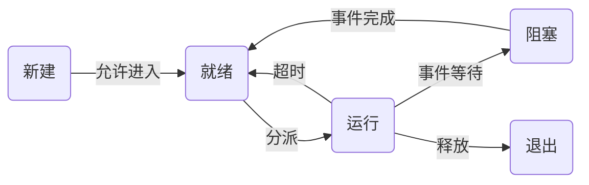
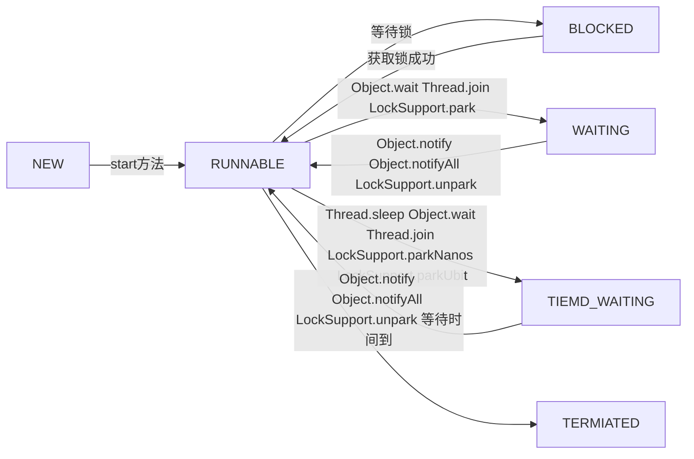

# 多线程

http://book.bugstack.cn/#s/50S6w8vw

## 进程与线程

- 最初的计算机：用户每输入一个指令，计算机就做出一个操作，当用户在思考或者输入时。计算机就在等待。
- 批处理操作系统：把一系列的指令写下来形成清单一次性交给计算机执行
- 进程的提出：采用CPU轮转让操作系统并发，每个程序执行在一个进程中
- 线程的提出：进程包含多个线程，每个线程单独负责一个子任务

## 多进程与多线程都可以实现并发，为什么要使用多线程？

- 进程间通信比较复杂，线程间资源共享简单
- 进程是重量级的，线程是轻量级的，多线程开销更小

## 进程与线程的区别

- 本质区别是是否单独占有内存地址空间及其他系统资源
- 进程单独占有内存地址空间，所以进程间存在内存隔离，数据是分开的，数据共享复杂，但是同步简单；线程相反，数据共享简单，但是同步复杂
- 进程稳定，一个崩溃不会影响其他，线程崩溃可能影响整个程序的稳定
- 进程创建和销毁不但需要保存寄存器和栈信息，还需要资源分配回收以及页调度，开销较大，线程只需要保存寄存器和栈信息，开销较小
- 进程是操作系统进行资源分配的基本单位，线程是操作系统进行调度的基本单位

## 上下文切换

- 上下文是指某一时间点CPU寄存器和程序计数器的内容，上下文切换是把这些内容保存到内存中，上下文恢复是把内存中的内容拿出来恢复到寄存器和程序计数器，上下文切换是计算密集型的，会消耗大量CPU时间，故线程也不是越多越好。

## 继承Thread类实现多线程

```java
public class Demo {
    public static class MyThread extends Thread{
        @Override
        public void run(){
            System.out.println("MyThread");
        }
    }
    public static void main(String[] args) {
        var thread=new MyThread();
        thread.start();//调用start方法以后，虚拟机会先创建一个线程，然后等到这个线程第一次得到时间片时再调用run方法
    }
}
```

## 实现Runnable接口

```java
public class Demo {
    public static class MyThread implements Runnable{
        @Override
        public void run(){
            System.out.println("MyThread");
        }
    }
    public static void main(String[] args) {
       new Thread(new MyThread()).start();
       new Thread(()->{
           System.out.println("java8线程方法");
       }).start();
    }
}
```

java8以后可以使用函数式接口：

```java
@FunctionalInterface
public interface Runnable {
    public abstract void run();
}

public static void main(String[] args) {
       new Thread(()->{
           System.out.println("java8线程方法");
       }).start();
 }
```

## Thread源码

Java.lang.Thread

//todo

## Callable、Future、FutureTask

Callable也是一个函数式接口，Callable在`java.util.concurrent`包中，而Thread在`java.lang`包中

```java
@FunctionalInterface
public interface Callable<V> {
    V call() throws Exception;
}
```

实际使用方法：

```java
public class DemoCallable implements Callable<Integer> {

    @Override
    public Integer call() throws Exception {
        Thread.sleep(2000);
        return 0;
    }

    public static void main(String[] args) throws ExecutionException, InterruptedException {
        var executor = Executors.newCachedThreadPool();
        var demoCallable = new DemoCallable();
        var result = executor.submit(demoCallable);
        System.out.println(result.get());//get会阻塞，最好设置超时
    }
}
```

Future接口只有几个比较简单的方法：

```java
package java.util.concurrent;

public interface Future<V> {
    boolean cancel(boolean mayInterruptIfRunning);
    boolean isCancelled();
    boolean isDone();
    V get() throws InterruptedException, ExecutionException;
    V get(long timeout, TimeUnit unit)
        throws InterruptedException, ExecutionException, TimeoutException;
}

```

cancle试图取消一个线程的执行，注意是试图取消，并不一定能取消成功。因为任务可能已完成、已取消、或者一些其它因素不能取消，存在取消失败的可能。boolean类型的返回值是“是否取消成功”的意思。参数paramBoolean表示是否采用中断的方式取消线程执行。所以有时候，为了让任务有能够取消的功能，就使用Callable来代替Runnable。如果为了可取消性而使用Future但又不提供可用的结果，则可以声明Future<?>形式类型、并返回null作为底层任务的结果。

FutureTask实现了RunnableFuture接口，RunnableFuture接口同时继承了Runnable、Future接口

```java
public class FutureTask<V> implements RunnableFuture<V>
public interface RunnableFuture<V> extends Runnable, Future<V>
```

FutureTask的实现

```java
public class DemoFutureTask implements Callable<Integer> {
    @Override
    public Integer call() throws Exception {
        Thread.sleep(3000);
        return 0;
    }

    public static void main(String[] args) throws ExecutionException, InterruptedException {
        var executor = Executors.newCachedThreadPool();
        var futureTask = new FutureTask<>(new DemoFutureTask());
        executor.submit(futureTask);
        System.out.println(futureTask.get());
    }
}
```

在很多高并发的环境下，有可能Callable和FutureTask会创建多次。FutureTask能够在高并发环境下确保任务只执行一次。

## 线程组和线程优先级

- 线程组，每个线程都要属于一个线程组，如果没有就默认父线程设置为自己的线程组

```java
public class Demo {
    public static void main(String[] args) {
        Thread testThread = new Thread(() -> {
            System.out.println("testThread当前线程组名字：" +
                    Thread.currentThread().getThreadGroup().getName());
            System.out.println("testThread线程名字：" + 
                    Thread.currentThread().getName());
        });
        testThread.start();
        System.out.println("执行main方法线程名字：" + 
                Thread.currentThread().getName());
    }
}
```

- 线程的优先级

```java
public class Demo {
    public static void main(String[] args) {
        Thread a = new Thread();
        System.out.println("默认的线程优先级：" + a.getPriority());
        Thread b = new Thread();
        b.setPriority(8);
        System.out.println("设置过的线程优先级：" + b.getPriority());
    }
}
```

但是注意这个优先级不太可靠，这个优先级只是给操作系统的一个建议，操作系统未必采纳，真正的调用顺序是由操作系统的线程调度算法决定的

```java
public class Demo {
    public static void main(String[] args) {
        IntStream.rangeClosed(1,10).forEach(it->{
            var thread=new Thread(()->
                System.out.println("当前线程："+Thread.currentThread().getName()+
                        ",线程优先级："+Thread.currentThread().getPriority())
            );
            thread.setPriority(it);
            thread.start();
        });
    }
}

当前线程：Thread-4,线程优先级：5
当前线程：Thread-3,线程优先级：4
当前线程：Thread-1,线程优先级：2
当前线程：Thread-7,线程优先级：8
当前线程：Thread-5,线程优先级：6
当前线程：Thread-9,线程优先级：10
当前线程：Thread-6,线程优先级：7
当前线程：Thread-8,线程优先级：9
当前线程：Thread-0,线程优先级：1
当前线程：Thread-2,线程优先级：3
```

如果某个线程优先级大于线程组的优先级，那么线程优先级会失效用线程组的优先级代替

- 线程组做统一异常处理

```java
public class Demo {
    public static void main(String[] args) {
        var threadGroup=new ThreadGroup("group1"){
            @Override
            public void uncaughtException(Thread t, Throwable e) {
                System.out.println(t.getName()+":"+e.getMessage());
            }
        };

        var thread1 = new Thread(threadGroup, () -> {
             throw new RuntimeException("测试异常");
        });
        thread1.start();
    }
}
```

- 总结来说，线程组是一个树状的结构，每个线程组下面可以有多个线程或者线程组。线程组可以起到统一控制线程的优先级和检查线程的权限的作用。

## ThreadGroup源码

//todo

## 线程状态及其转换

操作系统的线程主要有就绪、执行、等待状态



Java线程有6个状态

```java
public enum State {
        NEW,
        RUNNABLE,
        BLOCKED,
        WAITING,
        TIMED_WAITING,
        TERMINATED;
 }
```

- 处于NEW状态的是尚未调用Start的方法

```java
var Thread=new Thread();
System.out.println(Thread.getState());
```

- 处于RUNNABLE状态的线程在Java虚拟机中允许，也有可能在等待其它系统资源，它包含了传统操作系统的ready和running两个状态

- 处于BLOCKED状态的线程正在等待锁的释放以进入同步区

- 处于WAITING状态的线程变成RUNNABLE状态需要其它线程唤醒，调用一下方法进入等待

  - Object.wait()
  - Thread.join()
  - LockSupport.park()

  使用notify、notifyAll唤醒

- 处于TIMED_WAITING的线程等待一个具体的时间，时间到后会被自动唤醒
- 处于TERNINATED的线程终止状态，此时线程已经执行完毕



# 并发包

## CountDownLatch

[参考链接](https://blog.csdn.net/qq812908087/article/details/81112188)

1. 主线程等待子线程结束

```java
import java.util.concurrent.CountDownLatch;
import java.util.concurrent.TimeUnit;

public class test1 {
    public static void main(String[] args) throws InterruptedException {
        CountDownLatch latch = new CountDownLatch(10);

        for (int i=0; i<10; i++) {//i<10等3秒多一点，i<9等10秒多一点
            new Thread(new Runnable() {
                @Override
                public void run() {
                    System.out.println(Thread.currentThread().getName() + " 运行");
                    try {
                        Thread.sleep(3000);
                    } catch (InterruptedException e) {
                        e.printStackTrace();
                    } finally {
                        latch.countDown();
                    }
                }
            }).start();
        }

        System.out.println("等待子线程运行结束");
        latch.await(10, TimeUnit.SECONDS);//如果等10秒时候还没返回，那就自己结束
        System.out.println("子线程运行结束");
    }
}
```

2. 子线程等待主线程处理完毕开始处理，子线程处理完毕后，主线程输出

```java
import java.util.concurrent.CountDownLatch;

public class test2 {
    public static void main(String[] args) throws InterruptedException {
        CountDownLatch countDownLatch = new CountDownLatch(1);
        CountDownLatch await = new CountDownLatch(5);

        for (int i=0; i< 5; i++) {
            new Thread(()->{
                try {
                    countDownLatch.await();//主线程计数器上等待
                    System.out.println("子线程" +Thread.currentThread().getName()+ "处理自己事情");
                    Thread.sleep(1000);
                    await.countDown();
                } catch (InterruptedException e) {
                    e.printStackTrace();
                }
            }).start();
        }

        System.out.println("主线程处理自己事情");
        Thread.sleep(3000);
        countDownLatch.countDown();//主线程计数器降为0,开始执行子线程
        System.out.println("主线程处理结束");
        await.await();//子线程计数器上等待
        System.out.println("子线程处理完毕啦");
    }
}
```

# 并发编程实战

## 第一章

```java
public class test1 {
    private int value;
    public void addValue() {
        value++;
    }

    public static void main(String[] args) throws InterruptedException {
        var test1=new test1();
        final var countDownLatch=new CountDownLatch(10);
        for(int i=0;i<10;i++){
            new Thread(()->{
                for(int j=0;j<10000;j++) {
                    test1.addValue();
                }
                countDownLatch.countDown();
            }).start();
        }
        countDownLatch.await();
        System.out.println("最后结果:"+test1.value);
    }
}
```

最后结果:小于10000

```java
public class test1 {
    private int value;
    public synchronized void addValue() {
        value++;
    }

    public static void main(String[] args) throws InterruptedException {
        var test1=new test1();
        final var countDownLatch=new CountDownLatch(10);
        for(int i=0;i<10;i++){
            new Thread(()->{
                for(int j=0;j<10000;j++) {
                    test1.addValue();
                }
                countDownLatch.countDown();
            }).start();
        }
        countDownLatch.await();
        System.out.println("最后结果:"+test1.value);
    }
}
```

最后结果:100000

## 第二章

- “无状态对象一定是线程安全的。”


```java
public class StatelessFactorizer {
    public void service(int x){
        Integer i=x;
        Integer[] factors=factor(i);
        System.out.println(x+":"+factors[0]+","+factors[1]);
    }

    public Integer[] factor(int x){
        return new Integer[]{x/2,x%2};
    }

    public static void main(String[] args) throws InterruptedException {
        final var countDownLatch=new CountDownLatch(10);
        StatelessFactorizer sf=new StatelessFactorizer();
        for(int i=0;i<10;i++){
            new Thread(()->{
                for(int j=100;j<200;j++) {
                   sf.service(j);
                }
                countDownLatch.countDown();
            }).start();
        }
        countDownLatch.await();
    }
}
```

- 希望加一个统计函数调用次数的统计量，变的线程不安全，由数据竞争导致

```java
public class StatelessFactorizer {
    private long count=0;
    public long getCount(){
        return count;
    }
    public void service(int x){
        Integer i=x;
        Integer[] factors=factor(i);
        count++;
        //有这一句会使得count极为接近真实值
        System.out.println(x+":"+factors[0]+","+factors[1]);
    }

    public Integer[] factor(int x){
        return new Integer[]{x/2,x%2};
    }

    public static void main(String[] args) throws InterruptedException {
        final var countDownLatch=new CountDownLatch(10);
        StatelessFactorizer sf=new StatelessFactorizer();
        for(int i=0;i<10;i++){
            new Thread(()->{
                for(int j=0;j<10000;j++) {
                   sf.service(j);
                }
                countDownLatch.countDown();
            }).start();
        }
        countDownLatch.await();
        System.out.println("调用次数:"+sf.count);
    }
}
```

- 通过引入一个原子变量来确保线程安全

```java
public class CountingFactorizer {
    private final AtomicLong count=new AtomicLong(0);

    public void service(int x){
        Integer i=x;
        Integer[] factors=factor(i);
        count.incrementAndGet();
        //System.out.println(x+":"+factors[0]+","+factors[1]);
    }

    public Integer[] factor(int x){
        return new Integer[]{x/2,x%2};
    }

    public static void main(String[] args) throws InterruptedException {
        final var countDownLatch=new CountDownLatch(10);
        final var cf=new CountingFactorizer();
        for(int i=0;i<10;i++){
            new Thread(()->{
                for(int j=0;j<10000;j++) {
                    cf.service(j);
                }
                countDownLatch.countDown();
            }).start();
        }
        countDownLatch.await();
        System.out.println("调用次数:"+cf.count.get());
    }
}
```

- 延迟初始化中竞态条件导致的线程不安去

```java
public class LazyInitRace {
    private Object instance=null;
    public Object getInstance() throws InterruptedException {
        Thread.sleep(200);
        if(instance==null) {
            instance = new Object();
        }
        return instance;
    }

    public static void main(String[] args) throws InterruptedException {
        final var countDownLatch=new CountDownLatch(10);
        LazyInitRace lazyInitRace=new LazyInitRace();
        for(int i=0;i<50;i++){
            new Thread(()->{
                try {
                    System.out.println(lazyInitRace.getInstance()==lazyInitRace.getInstance());
                } catch (InterruptedException e) {
                    e.printStackTrace();
                }
                countDownLatch.countDown();
            }).start();
        }
        countDownLatch.await();
    }
}
```

- 对这个服务做缓存，如果已经上次计算过，就直接获取，尽管对set方法的每次调用都是原子的，但仍然无法同时更新lastNumber和lastFactors

```java
public class UnsafeCachingFactorizer {
    private final AtomicReference<Integer> lastNumber = new AtomicReference<>();
    private final AtomicReference<Integer[]> lastFactors = new AtomicReference<>();

    public void service(int x) {
        Integer i = x;
        if (lastNumber.equals(x)) {
            System.out.println(x + ":" + lastFactors.get()[0] + lastFactors.get()[1]);
        } else {
            Integer[] factors = factor(i);
            lastNumber.set(x);
            lastFactors.set(factors);
            System.out.println(x + ":" + factors[0] + "," + factors[1]);
        }
    }

    public Integer[] factor(int x) {
        return new Integer[]{x / 2, x % 2};
    }
}
```

- 解决这个问题的办法就是对方法上锁

```java
public class UnsafeCachingFactorizer {
    private final Integer lastNumber;
    private final Integer[] lastFactors;

    public synchronized void service(int x) {
        Integer i = x;
        if (lastNumber.equals(x)) {
            System.out.println(x + ":" + lastFactors.get()[0] + lastFactors.get()[1]);
        } else {
            Integer[] factors = factor(i);
            lastNumber.set(x);
            lastFactors.set(factors);
            System.out.println(x + ":" + factors[0] + "," + factors[1]);
        }
    }

    public Integer[] factor(int x) {
        return new Integer[]{x / 2, x % 2};
    }
}
```

- 锁同步,下面的代码实现了锁的重入，如果不能重入，那么代码会死锁，但是代码实际未发生死锁，但是要注意的是当重写父类中的同步方法，如果想要达到同步的效果重写方法也必须是同步化的

```java
public class Widget extends SuperWidget{
    @Override
    public synchronized void doSomething(){
        System.out.println("hello");
        super.doSomething();
    }

    public static void main(String[] args) {
        new Widget().doSomething();
    }
}

class SuperWidget{
    public synchronized void doSomething(){
        System.out.println("hello supper");
    }
}
```

- 线程调用了一个对象的同步方法，那么它也可以调用对象的另外一个同步方法

```java
public class InstanceSychronized {
    public synchronized void fun1() {
        System.out.println("我是一号同步方法");
        this.fun2();//调用二号同步方法
    }

    //同步方法2
    public synchronized void fun2() {
        System.out.println("我是二号同步方法");
        this.fun3();//调用三号同步方法
    }

    //同步方法3
    public synchronized void fun3() {
        System.out.println("我是三号同步方法");
    }

    public static void main(String[] args) {
        var is = new InstanceSychronized();
        new Thread(() -> {
            is.fun1();
        }).start();
    }
}
```

- 活跃性与性能

```java
public class CachedFactorizer {
    private Integer lastNumber;
    private Integer[] lastFactors;
    private long hits;
    private long cacheHints;
    public synchronized long getHits(){
        return hits;
    }
    public synchronized double getCacheHitRatio(){
        return (double)cacheHints/(double)hits;
    }
    public void service(int x){
        Integer i=x;
        Integer[] factors=null;
      //负责保护判断是否只需返回缓存结果的“先检查后执行”操作序列
        synchronized (this){
            ++hits;
            if(i.equals(lastNumber)){
                ++cacheHints;
                factors=lastFactors.clone();
            }
        }
        if(factors==null){
            factors=factor(i);//耗时操作，尽量不要同步
          //负责确保对缓存的数值和因数分解结果进行同步更新
            synchronized (this){
                lastNumber=i;
                lastFactors=factors.clone();
            }
        }
    }

    private Integer[] factor(Integer x) {
        return new Integer[]{x/2,x%2};
    }
}

```

# 其它

一个JVM 启动之后，自己会启动一些线程

## 必备五线程

- Attach Listener ：线程是负责接收到外部的命令，而对该命令进行执行并且把结果返回给发送者。通常我们会用一些命令去要求jvm给我们一些反馈信息，如：java -version、jmap、jstack等等。如果该线程在jvm启动的时候没有初始化，那么，则会在用户第一次执行jvm命令时，得到启动。
- signal dispather： 前面我们提到第一个Attach Listener线程的职责是接收外部jvm命令，当命令接收成功后，会交给signal dispather线程去进行分发到各个不同的模块处理命令，并且返回处理结果。signal dispather线程也是在第一次接收外部jvm命令时，进行初始化工作。
- Finalizer：  用来执行所有用户Finalizer 方法的线程。
- Reference Handler ：它主要用于处理引用对象本身（软引用、弱引用、虚引用）的垃圾回收问题。
- Common-Cleaner：
- Monitor Ctrl-Break：监控ctrl-c
- Main：主线程

## RMI线程

- ***RMI TCP Connection(2)-127.0.0.1***
- ***RMI Scheduler(0)***
- ***RMI TCP Connection(1)-127.0.0.1***
- ***RMI TCP Accept-0***

一个Tomcat启动以后，后台一些常用线程的作用

- 名字里带有 Catalina-utility的是Tomcat中的工具线程，主要是干杂活，比如在后台定期检查Session是否过期、定期检查Web应用是否更新（热部署热加载）、检查异步Servlet的连接是否过期等等。
- 名字里带有Acceptor的线程负责接收浏览器的连接请求。
- 名字里带有Poller的线程，其实内部是个Selector，负责侦测IO事件。
- 名字里带有Catalina-exec的是工作线程，负责处理请求。


